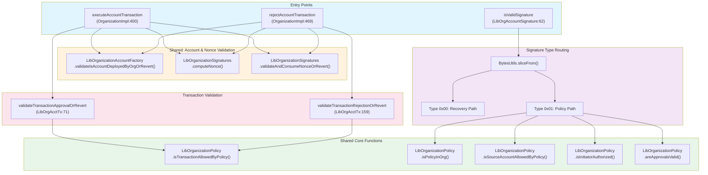
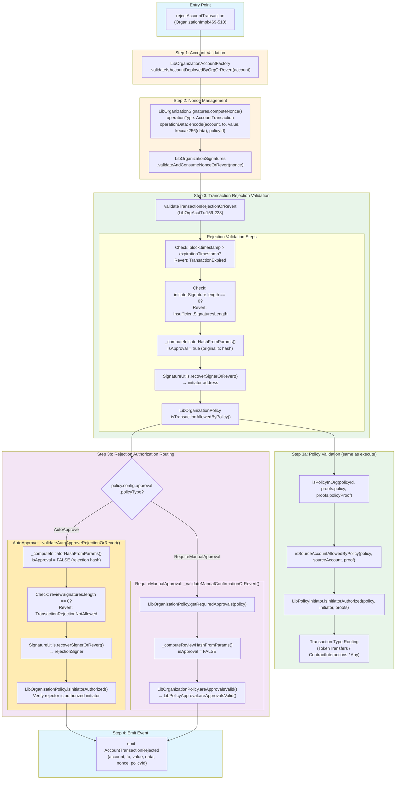
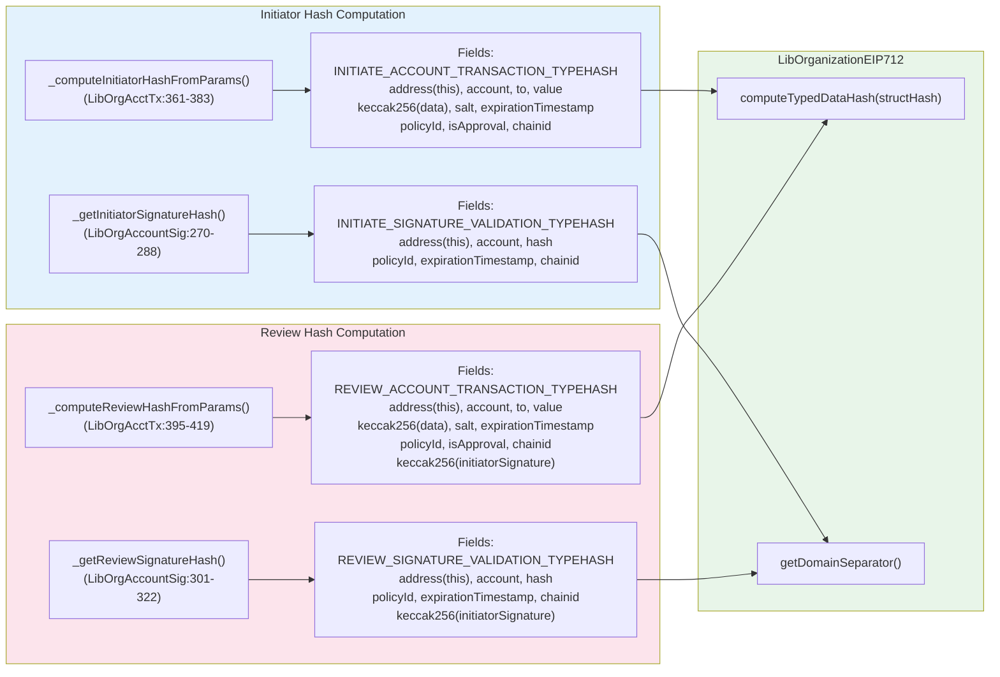

# Function Call Flow Diagram

This document visualizes the function call flow for:
- `executeAccountTransaction` (OrganizationImplementation.sol:400)
- `rejectAccountTransaction` (OrganizationImplementation.sol:469)
- `isValidSignature` (LibOrganizationAccountSignature.sol:62)

## High-Level Overview

## Detailed Flow: executeAccountTransaction

```mermaid
flowchart TB
    subgraph Entry["Entry Point"]
        execute["executeAccountTransaction<br/>(OrganizationImpl:400-453)"]
    end

    subgraph Step1["Step 1: Account Validation"]
        validateAccount["LibOrganizationAccountFactory<br/>.validateIsAccountDeployedByOrgOrRevert(account)"]
    end

    subgraph Step2["Step 2: Nonce Management"]
        computeNonce["LibOrganizationSignatures.computeNonce()<br/>operationType: AccountTransaction<br/>operationData: encode(account, to, value, keccak256(data), policyId)"]
        consumeNonce["LibOrganizationSignatures<br/>.validateAndConsumeNonceOrRevert(nonce)"]
    end

    subgraph Step3["Step 3: Transaction Approval Validation"]
        validateApproval["validateTransactionApprovalOrRevert<br/>(LibOrgAcctTx:71-137)"]

        subgraph ApprovalChecks["Approval Validation Steps"]
            checkExpiry["Check: block.timestamp > expirationTimestamp?<br/>Revert: TransactionExpired"]
            checkInitSig["Check: initiatorSignature.length == 0?<br/>Revert: InsufficientSignaturesLength"]
            computeInitHash["_computeInitiatorHashFromParams()<br/>isApproval = true"]
            recoverInit["SignatureUtils.recoverSignerOrRevert()<br/>→ initiator address"]
            checkPolicy["LibOrganizationPolicy<br/>.isTransactionAllowedByPolicy()"]
        end
    end

    subgraph Step3a["Step 3a: Policy Validation (isTransactionAllowedByPolicy)"]
        policyInOrg["isPolicyInOrg(policyId, proofs.policy, proofs.policyProof)"]
        sourceAllowed["isSourceAccountAllowedByPolicy(policy, sourceAccount, proof)"]
        initiatorAuth["LibPolicyInitiator.isInitiatorAuthorized(policy, initiator, proofs)"]

        subgraph TxTypeRouting["Transaction Type Routing"]
            checkTxType{"proofs.policy.config<br/>.transactionType?"}

            tokenPath["TokenTransfers"]
            tokenCheck["TokenTransferUtils<br/>.isTransactionTokenTransfer(data, value)"]
            tokenAllowed["LibPolicyTokenTransfer<br/>.isTokenTransferAllowedByPolicy()"]

            contractPath["ContractInteractions"]
            notTokenCheck["NOT TokenTransferUtils<br/>.isTransactionTokenTransfer()"]
            contractAllowed["LibPolicyContractInteraction<br/>.isContractInteractionAllowedByPolicy()"]

            anyPath["Any"]
            destAllowed["LibPolicyDestination<br/>.isDestinationAllowedByPolicy()"]
        end
    end

    subgraph Step3b["Step 3b: Manual Approval (if RequireManualApproval)"]
        checkPolicyType{"policy.config.approval<br/>.policyType?"}
        manualValidation["_validateManualConfirmationOrRevert()<br/>(LibOrgAcctTx:323-349)"]
        getRequired["LibOrganizationPolicy.getRequiredApprovals(policy)"]
        computeReviewHash["_computeReviewHashFromParams()<br/>includes initiatorSignature hash"]
        checkApprovals["LibOrganizationPolicy.areApprovalsValid()<br/>→ LibPolicyApproval.areApprovalsValid()"]
    end

    subgraph Step4["Step 4: Time-Based Limits"]
        timeLimitCheck["_validateAndUpdateTimeBasedLimitOrRevert()<br/>(LibOrgAcctTx:241-276)"]
        checkLimitation{"policy.config.timeLimit<br/>.limitation == TimeInterval?"}
        getDestination["LibOrganizationPolicy.getActualDestination(to, data, value)"]
        calcUsage{"policy.config.transactionType<br/>== TokenTransfers?"}
        extractAmount["TokenTransferUtils.extractTransferAmount(data, value)"]
        countUsage["usageAmount = 1"]
        updateLimit["LibOrganizationPolicy.checkAndUpdateTimeBasedLimit()<br/>→ LibPolicyTimeBasedLimits"]
    end

    subgraph Step5["Step 5: Execution"]
        emitEvent["emit AccountTransactionExecuted"]
        executeCall["IAccount(account).executeTransaction()<br/>(to, value, data, nonce, policyId)"]
    end

    execute --> validateAccount
    validateAccount --> computeNonce
    computeNonce --> consumeNonce
    consumeNonce --> validateApproval

    validateApproval --> checkExpiry
    checkExpiry --> checkInitSig
    checkInitSig --> computeInitHash
    computeInitHash --> recoverInit
    recoverInit --> checkPolicy

    checkPolicy --> policyInOrg
    policyInOrg --> sourceAllowed
    sourceAllowed --> initiatorAuth
    initiatorAuth --> checkTxType

    checkTxType --> tokenPath
    tokenPath --> tokenCheck
    tokenCheck --> tokenAllowed

    checkTxType --> contractPath
    contractPath --> notTokenCheck
    notTokenCheck --> contractAllowed

    checkTxType --> anyPath
    anyPath --> destAllowed

    checkPolicy --> checkPolicyType
    checkPolicyType -->|RequireManualApproval| manualValidation
    manualValidation --> getRequired
    getRequired --> computeReviewHash
    computeReviewHash --> checkApprovals

    checkPolicyType -->|AutoApprove| timeLimitCheck
    checkApprovals --> timeLimitCheck

    timeLimitCheck --> checkLimitation
    checkLimitation -->|Yes| getDestination
    getDestination --> calcUsage
    calcUsage -->|TokenTransfers| extractAmount
    calcUsage -->|Other| countUsage
    extractAmount --> updateLimit
    countUsage --> updateLimit
    checkLimitation -->|No| emitEvent
    updateLimit --> emitEvent
    emitEvent --> executeCall

    style Entry fill:#e1f5fe
    style Step1 fill:#fff3e0
    style Step2 fill:#fff3e0
    style Step3 fill:#e8f5e9
    style Step3a fill:#e8f5e9
    style Step3b fill:#f3e5f5
    style Step4 fill:#fce4ec
    style Step5 fill:#e1f5fe
```

## Detailed Flow: rejectAccountTransaction

## Detailed Flow: isValidSignature

```mermaid
flowchart TB
    subgraph Entry["Entry Point"]
        isValid["isValidSignature<br/>(LibOrgAccountSignature:62-90)"]
    end

    subgraph Step1["Step 1: Signature Parsing"]
        checkEmpty["Check: signature.length == 0?<br/>Return: ERC1271_INVALID_VALUE"]
        extractType["Extract signatureType = uint8(signature[0])"]
        sliceData["BytesUtils.sliceFrom(signature, 1)<br/>→ signatureData (without type prefix)"]
    end

    subgraph Step2a["Path A: Recovery Signature (type = 0x00)"]
        validateRecovery["_validateRecoverySignature()<br/>(LibOrgAccountSignature:99-118)"]
        checkSupported["LibOrganizationTxRecovery<br/>.isRecoverySupportedForTxAndERC1271()"]
        checkEnabled["LibOrganizationTxRecovery<br/>.isRecoveryEnabledForTxAndERC1271()"]
        validateRecoverySig["LibOrganizationTxRecovery<br/>.isValidRecoverySignature(hash, signatureData)"]
        recoveryResult{"Valid?"}
        recoveryValid["Return: ERC1271_MAGIC_VALUE"]
        recoveryInvalid["Return: ERC1271_INVALID_VALUE"]
    end

    subgraph Step2b["Path B: Policy-Based Signature (type = 0x01)"]
        validatePolicy["_validatePolicyBasedSignature()<br/>(LibOrgAccountSignature:134-215)"]

        subgraph Decode["Decode ABI-encoded signatureData"]
            decodeData["abi.decode → <br/>policyId, expirationTimestamp,<br/>initiatorSignature, reviewSignatures,<br/>guardianSignature, proofs"]
        end

        subgraph InitiatorValidation["Initiator Validation"]
            checkPolicyExpiry["Check: block.timestamp > expirationTimestamp?<br/>Return: ERC1271_INVALID_VALUE"]
            checkInitSigLen["Check: initiatorSignature.length == 0?<br/>Return: ERC1271_INVALID_VALUE"]
            getInitHash["_getInitiatorSignatureHash()<br/>(account, hash, policyId, expirationTimestamp)"]
            recoverInitiator["SignatureUtils.tryRecoverSigner()<br/>→ (initiatorValid, initiator)"]
            checkInitValid["Check: !initiatorValid?<br/>Return: ERC1271_INVALID_VALUE"]
        end

        subgraph GuardianValidation["Guardian Validation"]
            getReviewHash["_getReviewSignatureHash()<br/>(account, hash, policyId, expirationTimestamp, initiatorSignature)"]
            getGuardian["LibOrganizationGuardian.getGuardian()"]
            recoverGuardian["SignatureUtils.tryRecoverSigner()<br/>(guardianSignature, reviewHash)"]
            checkGuardianValid["Check: !guardianValid OR recoveredGuardian != guardian?<br/>Return: ERC1271_INVALID_VALUE"]
        end

        subgraph PolicyValidation["Policy Validation (_isERC1271SignatureAllowedByPolicy)"]
            policyInOrg["LibOrganizationPolicy.isPolicyInOrg()<br/>(policyId, proofs.policy, proofs.policyProof)"]
            checkTxType["Check: policy.config.transactionType != Signatures?<br/>Return: false"]
            sourceAllowed["LibOrganizationPolicy.isSourceAccountAllowedByPolicy()<br/>(policy, account, proofs.sourceAccountProof)"]
            initiatorAuth["LibOrganizationPolicy.isInitiatorAuthorized()<br/>(policy, initiator, proofs.initiatorProofs)"]
        end

        subgraph ApprovalRouting["Approval Type Routing"]
            checkApprovalType{"policy.config.approval<br/>.policyType?"}
            autoApprove["AutoApprove:<br/>Return: ERC1271_MAGIC_VALUE<br/>(guardian + initiator sufficient)"]
            manualApprove["RequireManualApproval:<br/>Check reviewer signatures"]
            checkApprovals["LibOrganizationPolicy.areApprovalsValid()<br/>(policy, reviewSignatures, reviewHash, approverProofs)"]
            manualResult{"Valid approvals?"}
            manualValid["Return: ERC1271_MAGIC_VALUE"]
            manualInvalid["Return: ERC1271_INVALID_VALUE"]
        end
    end

    subgraph UnknownType["Unknown Signature Type"]
        unknownReturn["Return: ERC1271_INVALID_VALUE"]
    end

    isValid --> checkEmpty
    checkEmpty -->|Not empty| extractType
    extractType --> sliceData

    sliceData -->|type = 0x00| validateRecovery
    validateRecovery --> checkSupported
    checkSupported -->|Not supported| recoveryInvalid
    checkSupported -->|Supported| checkEnabled
    checkEnabled -->|Not enabled| recoveryInvalid
    checkEnabled -->|Enabled| validateRecoverySig
    validateRecoverySig --> recoveryResult
    recoveryResult -->|Yes| recoveryValid
    recoveryResult -->|No| recoveryInvalid

    sliceData -->|type = 0x01| validatePolicy
    validatePolicy --> decodeData
    decodeData --> checkPolicyExpiry
    checkPolicyExpiry --> checkInitSigLen
    checkInitSigLen --> getInitHash
    getInitHash --> recoverInitiator
    recoverInitiator --> checkInitValid
    checkInitValid --> getReviewHash
    getReviewHash --> getGuardian
    getGuardian --> recoverGuardian
    recoverGuardian --> checkGuardianValid
    checkGuardianValid --> policyInOrg
    policyInOrg --> checkTxType
    checkTxType --> sourceAllowed
    sourceAllowed --> initiatorAuth
    initiatorAuth --> checkApprovalType
    checkApprovalType -->|AutoApprove| autoApprove
    checkApprovalType -->|RequireManualApproval| manualApprove
    manualApprove --> checkApprovals
    checkApprovals --> manualResult
    manualResult -->|Yes| manualValid
    manualResult -->|No| manualInvalid

    sliceData -->|other| unknownReturn

    style Entry fill:#e1f5fe
    style Step1 fill:#fff3e0
    style Step2a fill:#c8e6c9
    style Step2b fill:#e8f5e9
    style Decode fill:#f5f5f5
    style InitiatorValidation fill:#e3f2fd
    style GuardianValidation fill:#fce4ec
    style PolicyValidation fill:#fff3e0
    style ApprovalRouting fill:#f3e5f5
    style UnknownType fill:#ffcdd2
```

## Shared Functions Visualization

```mermaid
flowchart TB
    subgraph Callers["Entry Point Functions"]
        execute["executeAccountTransaction"]
        reject["rejectAccountTransaction"]
        isValid["isValidSignature"]
    end

    subgraph SharedL1["Shared Layer 1: Signature & Hash Utils"]
        signatureRecover["SignatureUtils<br/>.recoverSignerOrRevert()<br/>.tryRecoverSigner()"]
        eip712["LibOrganizationEIP712<br/>.computeTypedDataHash()<br/>.getDomainSeparator()"]
    end

    subgraph SharedL2["Shared Layer 2: Policy Core Functions"]
        policyInOrg["LibOrganizationPolicy<br/>.isPolicyInOrg()"]
        sourceAccount["LibOrganizationPolicy<br/>.isSourceAccountAllowedByPolicy()"]
        initiatorAuth["LibOrganizationPolicy<br/>.isInitiatorAuthorized()<br/>→ LibPolicyInitiator"]
        txAllowed["LibOrganizationPolicy<br/>.isTransactionAllowedByPolicy()"]
    end

    subgraph SharedL3["Shared Layer 3: Approval Validation"]
        approvalsValid["LibOrganizationPolicy<br/>.areApprovalsValid()<br/>→ LibPolicyApproval"]
        getRequired["LibOrganizationPolicy<br/>.getRequiredApprovals()"]
    end

    subgraph UniqueExecute["Unique to executeAccountTransaction"]
        timeLimits["_validateAndUpdateTimeBasedLimitOrRevert()"]
        updateUsage["LibOrganizationPolicy<br/>.checkAndUpdateTimeBasedLimit()"]
        executeCall["IAccount.executeTransaction()"]
    end

    subgraph UniqueReject["Unique to rejectAccountTransaction"]
        autoReject["_validateAutoApproveRejectionOrRevert()"]
    end

    subgraph UniqueIsValid["Unique to isValidSignature"]
        recovery["_validateRecoverySignature()"]
        txRecovery["LibOrganizationTxRecovery.*"]
        guardian["LibOrganizationGuardian<br/>.getGuardian()"]
    end

    execute --> signatureRecover
    reject --> signatureRecover
    isValid --> signatureRecover

    execute --> eip712
    reject --> eip712
    isValid --> eip712

    execute --> txAllowed
    reject --> txAllowed

    execute --> policyInOrg
    reject --> policyInOrg
    isValid --> policyInOrg

    execute --> sourceAccount
    reject --> sourceAccount
    isValid --> sourceAccount

    execute --> initiatorAuth
    reject --> initiatorAuth
    isValid --> initiatorAuth

    execute --> approvalsValid
    reject --> approvalsValid
    isValid --> approvalsValid

    execute --> getRequired
    reject --> getRequired

    execute --> timeLimits
    timeLimits --> updateUsage
    execute --> executeCall

    reject --> autoReject

    isValid --> recovery
    recovery --> txRecovery
    isValid --> guardian

    txAllowed --> policyInOrg
    txAllowed --> sourceAccount
    txAllowed --> initiatorAuth

    style Callers fill:#e1f5fe
    style SharedL1 fill:#c8e6c9
    style SharedL2 fill:#a5d6a7
    style SharedL3 fill:#81c784
    style UniqueExecute fill:#ffecb3
    style UniqueReject fill:#ffcc80
    style UniqueIsValid fill:#ce93d8
```

## EIP-712 Hash Computation Details

---

## Summary Table: Shared Functions

| Function | executeAccountTx | rejectAccountTx | isValidSignature |
|----------|:----------------:|:---------------:|:----------------:|
| `LibOrganizationAccountFactory.validateIsAccountDeployedByOrgOrRevert()` | ✓ | ✓ | ✓ (via caller) |
| `LibOrganizationSignatures.computeNonce()` | ✓ | ✓ | - |
| `LibOrganizationSignatures.validateAndConsumeNonceOrRevert()` | ✓ | ✓ | - |
| `SignatureUtils.recoverSignerOrRevert()` / `tryRecoverSigner()` | ✓ | ✓ | ✓ |
| `LibOrganizationEIP712.computeTypedDataHash()` | ✓ | ✓ | ✓ |
| `LibOrganizationEIP712.getDomainSeparator()` | ✓ | ✓ | ✓ |
| `LibOrganizationPolicy.isTransactionAllowedByPolicy()` | ✓ | ✓ | - |
| `LibOrganizationPolicy.isPolicyInOrg()` | ✓ | ✓ | ✓ |
| `LibOrganizationPolicy.isSourceAccountAllowedByPolicy()` | ✓ | ✓ | ✓ |
| `LibOrganizationPolicy.isInitiatorAuthorized()` | ✓ | ✓ | ✓ |
| `LibOrganizationPolicy.areApprovalsValid()` | ✓* | ✓* | ✓* |
| `LibOrganizationPolicy.getRequiredApprovals()` | ✓* | ✓* | - |
| `_validateManualConfirmationOrRevert()` | ✓* | ✓* | - |
| `_validateAndUpdateTimeBasedLimitOrRevert()` | ✓ | - | - |
| `LibOrganizationPolicy.checkAndUpdateTimeBasedLimit()` | ✓ | - | - |
| `_validateAutoApproveRejectionOrRevert()` | - | ✓** | - |
| `LibOrganizationGuardian.getGuardian()` | - | - | ✓ |
| `LibOrganizationTxRecovery.*` | - | - | ✓*** |
| `IAccount.executeTransaction()` | ✓ | - | - |

**Legend:**
- ✓ = Always called
- ✓* = Only for `RequireManualApproval` policy type
- ✓** = Only for `AutoApprove` policy type
- ✓*** = Only for recovery signature type (0x00)

---

## Key Differences Between Functions

### executeAccountTransaction vs rejectAccountTransaction

| Aspect | executeAccountTransaction | rejectAccountTransaction |
|--------|---------------------------|--------------------------|
| **Purpose** | Execute a pending transaction | Cancel/reject a pending transaction |
| **Modifies state** | Yes (nonce consumed, time limits updated) | Yes (nonce consumed only) |
| **Time limits** | Validates and updates usage tracking | No time limit processing |
| **AutoApprove handling** | No additional validation needed | Requires rejection signature from authorized initiator |
| **ManualApproval handling** | Validates approval signatures | Validates rejection signatures (same threshold) |
| **Final action** | Calls `IAccount.executeTransaction()` | Emits `AccountTransactionRejected` event only |

### isValidSignature vs Transaction Functions

| Aspect | isValidSignature | execute/reject |
|--------|------------------|----------------|
| **State modification** | None (view function) | Yes |
| **Guardian signature** | Required for policy path | Not required |
| **Recovery path** | Supported (type 0x00) | Not supported |
| **Time limits** | Not supported (view function) | Supported |
| **Transaction type** | Must be `Signatures` | `TokenTransfers`, `ContractInteractions`, or `Any` |
| **Nonce management** | None | Required |

---

## File References

| File | Line Numbers | Key Functions |
|------|--------------|---------------|
| `OrganizationImplementation.sol` | 400-453 | `executeAccountTransaction()` |
| `OrganizationImplementation.sol` | 469-510 | `rejectAccountTransaction()` |
| `LibOrganizationAccountTransaction.sol` | 71-137 | `validateTransactionApprovalOrRevert()` |
| `LibOrganizationAccountTransaction.sol` | 159-228 | `validateTransactionRejectionOrRevert()` |
| `LibOrganizationAccountTransaction.sol` | 241-276 | `_validateAndUpdateTimeBasedLimitOrRevert()` |
| `LibOrganizationAccountTransaction.sol` | 288-309 | `_validateAutoApproveRejectionOrRevert()` |
| `LibOrganizationAccountTransaction.sol` | 323-349 | `_validateManualConfirmationOrRevert()` |
| `LibOrganizationAccountTransaction.sol` | 361-383 | `_computeInitiatorHashFromParams()` |
| `LibOrganizationAccountTransaction.sol` | 395-419 | `_computeReviewHashFromParams()` |
| `LibOrganizationAccountSignature.sol` | 62-90 | `isValidSignature()` |
| `LibOrganizationAccountSignature.sol` | 99-118 | `_validateRecoverySignature()` |
| `LibOrganizationAccountSignature.sol` | 134-215 | `_validatePolicyBasedSignature()` |
| `LibOrganizationAccountSignature.sol` | 231-258 | `_isERC1271SignatureAllowedByPolicy()` |
| `LibOrganizationPolicy.sol` | 101-163 | `isTransactionAllowedByPolicy()` |
| `LibOrganizationPolicy.sol` | 78-82 | `isPolicyInOrg()` |
| `LibOrganizationPolicy.sol` | 243-255 | `isSourceAccountAllowedByPolicy()` |
| `LibOrganizationPolicy.sol` | 226-232 | `isInitiatorAuthorized()` |
| `LibOrganizationPolicy.sol` | 175-184 | `areApprovalsValid()` |
