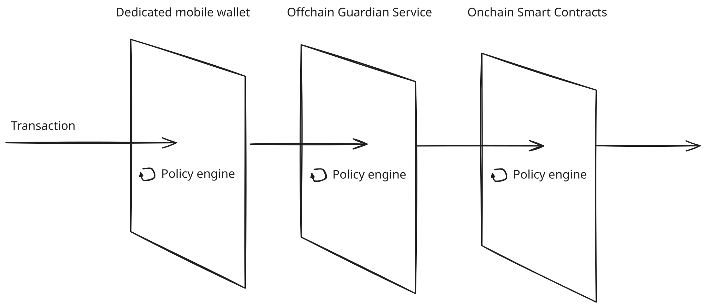
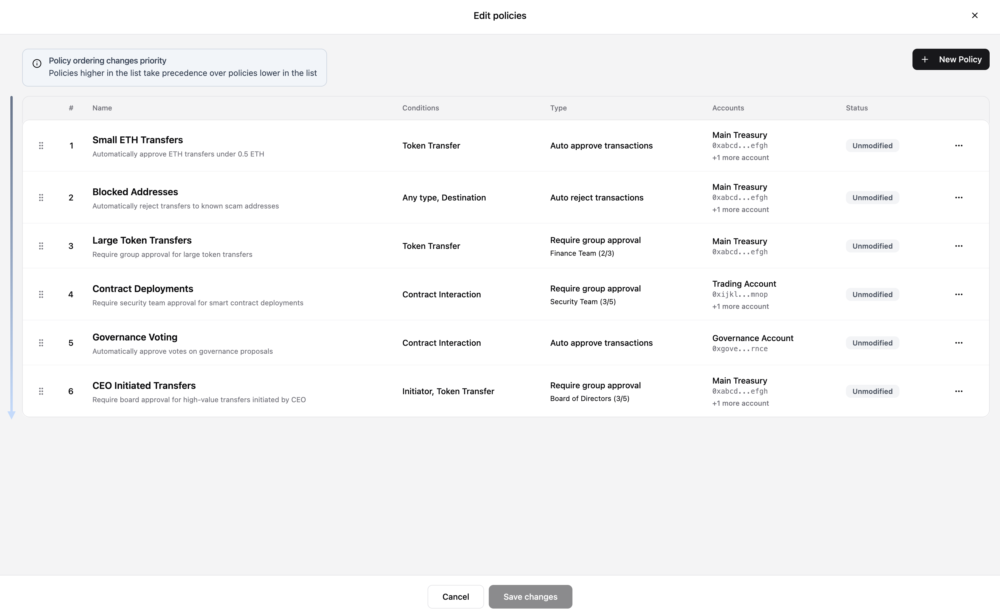
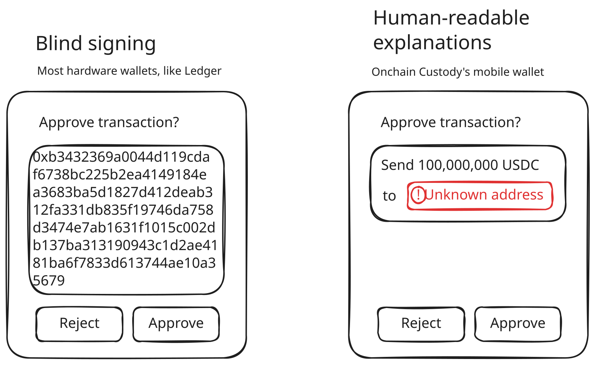
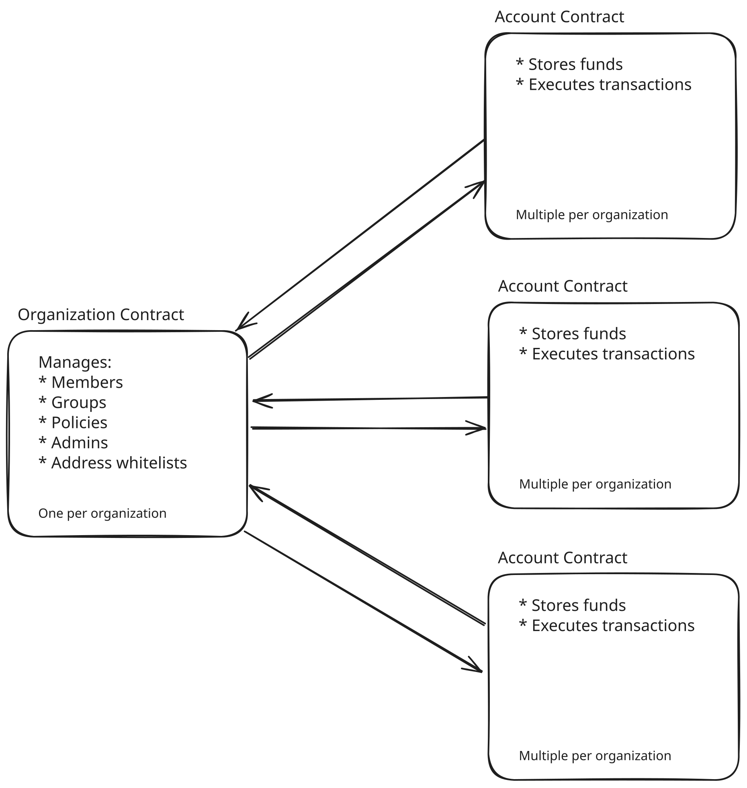

# Onchain Custody Smart Contracts
This repository contains the smart contracts for Onchain Custody.

> [!IMPORTANT]
> The contents of this document and this repository are confidential. Do not share without expressed written permission from the Den team.

> [!WARNING]
> The contracts in this repository are a "rough draft" whose only purpose is to reason through how Onchain Custody might be implemented.
>
> **This code is not production-ready, or even audit-ready, and should not be trusted.** It is not gas-optimized, tested, or fully functional.

## Onchain Custody Overview
Onchain Custody is a new category of cryptocurrency custody. It is non-custodial and provides all the benefits of self-custody while being significantly more secure than all other forms of custody (traditional custody, self-custody, and MPC).

Onchain Custody stores assets in a smart contract. Users interact with it via a web application and dedicated mobile wallet.


### Policy Engine
The heart of Onchain Custody is the **policy engine**. The policy engine allows users to specify rules (a.k.a. "policies") that dictate:
1. what transactions can be executed
2. who can execute them
3. how often they can be executed

 For example, an organization might set a policy that allows its finance team to transfer up to $100,000 in USDC per month, so long as 2 out of 3 members of the finance team approve the transaction.

Policies aren't limited to just simple token transfers, however. They can also be used to set rules for complex smart contract interactions and DeFi activities.


### Multiple Redundant Layers of Security
What makes Onchain Custody significantly more secure than all other existing forms of custody is that it uses **multiple redundant layers of security**.

Each of the layers operates independantly and all layers need to be compromised simultaneously in order for funds to be stolen. In contrast, other forms of custody, such as traditional custody, self-custody, and MPC, only need a single layer of security to be compromised.

In Onchain Custody, the three redundant layers of security are:
1. The dedicated mobile wallet
2. The offchain "Guardian" service 
3. The onchain smart contracts




In order to execute a transaction, all three layers independently run the policy engine to verify that the transaction is valid.

The order of operations is the following:
1. **The dedicated mobile wallet runs the policy engine locally.** 

    It will not allows users to approve a transaction if its policy engine fails to validate the transaction.
2. **The offchain Guardian service runs the policy engine in a secure centralized server.**
    
    It will not approve the transaction if its policy engine fails to validate the transaction.
3. **The smart contracts run the policy engine onchain.** 

    It will not allow the transaction to execute if its policy engines fails to validate the transaction. It will also prevent the transaction from executing if any approvals are missing from the account owners or the offchain Guardian service.

## Core Concepts
There are several core concepts in Onchain Custody:

1. **Organizations**

    An organization is a business or other non-individual entity that is using Onchain Custody.

2. **Members**

    Members are individuals who are a part of an Organization.

3. **Groups**

    Groups are collections of Members within an Organization. For example, an Organization might have a "Finance team" Group.

4. **Accounts**
    
    Accounts are where funds are stored and where transactions are executed. An Organization can have many Accounts.

5. **Policies**

    Policies are rules that dictate what types of transactions can be executed and by whom.

5. **Admins**

    An organization's Admin is a privileged Member or Group that can modify the Organization. Specifically, Admins can manage an Organization's Members, Groups, Accounts, Policies, Whitelist, and Admins. 
    
    If the Admin for an Organization is set to a Group, then an Approval Threshold must also be set. The Approval Threshold dictates how many Members of the Admin Group must approve an operation. 
    
    Any Member of the Admin Group can *propose* a change to the Organization (e.g. adding a new Member), but the change will not take effect until enough Members in the Admin Group approve the proposed change.

6. **Address Whitelists**

    Address Whitelists are lists of trusted addresses. By default, transactions cannot be sent to non-whitelisted addresses, however this is a setting that Admins can change.

7. **Transactions**

    Transactions can send tokens, take a DeFi action, or interact with any arbitrary smart contract from an Account. A Transaction can only be executed if a Policy has been set that explicitly allows the Transaction. 
    
    Dependening on the Policy, the Transaction may be automatically approved, automatically rejected, or require other Members of the Organization to approve it.


## Policies
Policies are "if-then" rules that dictate which transactions can be executed and by whom. 

Example policies:
- "if a transaction is sending more than $10,000, then require approval from 2 out of 3 members of the Finance team"
- "if a transaction is sending less than $10,000, then require approval from 1 out of 3 members of the Finance team"
- "if a transaction is sending less than $1,000 from the Accounts Payable Account, then automatically approve the transaction"

### Policy types
There are two types of policies:
1. **Auto-approval policies**

    If a transaction is governed by an Auto-approval policy, then it is automatically approved and can be executed. However, Auto-approval policies still require at least one signature from any organization member to ensure that transactions cannot be executed without explicit member approval.

2. **Manual approval policies**

    If a transaction is governed by a Manual approval policy, then it must be manually approved by a Member or Group before it can be executed.

    Similarly, if a transaction is governed by a Manual approval policy, then it must be manually rejected by a Member or Group before it is discarded.

    Manual approval policies must specifiy a Member or Group that is responsible for manually reviewing transactions. If a Group is specified, a voting threshold must also be specified (e.g. 2 out of 3 members of the group must approve or reject).

**Default behavior**: If a transaction does not match any Auto-approval or Manual approval policy, it is automatically rejected and cannot be executed.


### Policy filters for matching transactions
Policies have the following configurable fields that can be used to determine which types of transactions they govern:

- **Source Account**

    The account from which the transaction is sent. 
    This value can bet set to "any source account" or a custom user-defined list of accounts.

- **Transaction Initiator**

    The Member or Group who initiated the transaction.

    This field can be set to one of the following values:
    - "Any Member"
    - A specific Member
    - A specific Group

    If the value for the Transaction Initiator field is a group, then the policy applies to any transactions where the initiator is any of the Members in the Group.


- **Transaction Type** 
    
    This field can be set to one of the following values:
    - "Any type of transaction"
    - "Token transfers"
    - "Contract interactions"

- **Token** *(only available if  Transaction Type is "Token transfers")*

    The token being transfered in the transaction.

    This can be either "any token" or a specific token, e.g. USDC.

- **Token Transfer Recipient** *(only available if  Transaction Type is "Token transfers")*

    To whom the token is being sent to.

    This value can be one of the following:
    - "Any recipient"
    - "Any whitelisted address"
    - "Any non-whitelisted address"
    - Any address in a custom list defined by the user
    
- **Token Amount Threshold** *(only available if  Transaction Type is "Token transfers")*

    A threshold value for the amount of the token being transferred.

    If this value is set, then the policy only applies to transactions that are transferring an amount *less than or equal* to this value.

- **Contracts** *(only available if  Transaction Type is "Contract interactions")*

    The contract that the transaction is interacting with.

    This value can be one of the following:
    - "Any contract"
    - "Any whitelisted contract"
    - "Any non-whitelisted contract"
    - Any contract in a custom list defined by the user
    

- **Functions** *(only available if  Transaction Type is "Contract interactions")*

    The function being called in the contract interaction.

    This value can be one of the following:
    - "Any function"
    - Any function in a custom list defined by the user

    If a custom list of function is provided, each function can optionally have function arguments specified. If a function argument is specified, a policy will only match transactions that call the function with the specified argument. Not all arguments are required to be defined. If an argument is provided a value, than any value can be used to match the transaction.

### Policy limitations
Policies can be limited to either a single transaction at a time, or multiple transactions within a time interval.

For example, a time-based limitation on a Policy can be used to craft a policy that only allows a certain amount of tokens to be transfered every month.


*The user interface for editing a Policy's limitation in the Onchain Custody web application*

### Order of Policies
The order of policies is important in determining which policy governs a transaction.

Policies are defined by the user in an ordered list. The first policy that matches a transaction according to the policy's filters is the policy that governs the transaction.

If no policy matches a transaction, then the transaction is automatically rejected.


*The user interface for re-ordering Policies in the Onchain Custody web application*

### Demo of Policies
We highly recommend viewing the demo web application for Onchain Custody to understand how policies are defined from the web application.

To view a demo of Onchain Custody's user interface for modifying Policies, visit:
https://onchain-custody-demo.onchainden.com/policies

To view the demo, please request a username and password from the Den team.

## User flow for executing a transaction
The user flow for executing a transaction is the following:

1. **A Member of the Organization queues up a transaction**

    If the transaction does not match any policies, the Member will be unable to queue the transaction.

2. **Other Members approve the transaction in the web application**

    If the transaction is governed by a policy that requires manual approval by a Member or Group, then those Members must approve it in the web application.

3. **Members approve the transaction in their dedicated mobile wallets**

    After approving in the web application, Members must then also approve the transaction in their mobile wallets.

    Before approving the transaction, the mobile wallet will independently run the policy engine to verify that the transaction is valid. If the policy engine fails to verify that the transaction is valid, the user will be warned and will be unable to approve the transaction.

4. **After all approvals are provided, transaction can be executed via the web application**

    Once all approvals are provided via both the web application and mobile wallet, the Transaction initiator or any of the reviewers can execute the transaction via the web application.

    At this point, the Offchain Guardian Service will independently run the policy engine to verify that the transaction is valid. If the transaction is valid, it will submit it to the Onchain Smart Contracts, which will also independently run the policy engine onchain to verify the transaction before executing it.


## Mobile Wallet
Onchain Custody's dedicated mobile wallet is used by Organization Members and Admins to approve and reject transactions and other actions.

Under the hood, the mobile wallet securely stores a private key on a Member's mobile device. That private key is used to cryptographically sign approvals and rejections. 

The mobile wallet hosts a variety of features not found in other wallets that provide superior security and user experience.

> [!NOTE]
> We plan on also providing API support down the line as an alternative to mobile signing. Most users will still use the mobile wallet, but a subset will opt for the API to programatically control their accounts.

### Mobile Wallet Security Features
The dedicated Onchain Custody mobile has a suite of security features that make it significantly more secure that other hardware and software wallets:

1. **The mobile wallet can only be used with Onchain Custody to limit the attack surface.**

    In other forms of custody, such a self-custody (i.e. multisignature wallets), users can manage their cryptographic private keys using any external wallet, like Metamask or Ledger. 
    
    Those wallets can be used to sign *any* transaction and can be used with *any* decentralized application. If the wallet is used with a malicious or compromised decentralized application, the user can be tricked into signing a malicious transaction with the same private key that manages their funds, potentially causing their funds to be stolen.

    By having a dedicated mobile wallet that can only be used with Onchain Custody, user's private keys aren't being used to interact with other potentially dangerous applications.

2. **The mobile wallet shows users what they're *actually* approving.**
    
    A well known security limitation of many wallets, especially hardware wallets like Ledger, is "blind signing". Instead of displaying a human-readable explanation of what is being signed, these wallets display an obscure technical string of letter and numbers that users can't interperet.

    Users are therefore likely to accidentally approve malicious transactions.

    In contrast, Onchain Custody's dedicate mobile wallet decodes transactions into a human-readable format locally on the user's device, so they know exactly what the transaction they're signing will do. This makes it possible for users to easily identify and reject malicious transactions.

    

3. **The mobile wallet runs the Policy Engine locally to verify that a transaction is actually valid.**

    This is part of Onchain Custody's approach of having "multiple redundant layers of security". Before a user can approve a transaction, the Policy Engine runs locally on their device to determine if the transaction is valid to prevent them from being present malicious transactions in the first place.

4. **The mobile wallet stores private keys in secure hardware enclaves and trusted execution environments (TEE).**

    Similar to hardware wallets, the mobile wallet secure stores private keys in Secure Enclaves and Trusted Execution Environments (TEE) which isolate the private keys and prevent other applications from accessing them at a hardware level.

5. **The mobile wallet is harder compromise with malware.**

    Due to the locked-down and sandboxed nature of modern mobile operating systems, it is signficantly more difficult for attackers to install malware on a user's mobile device than it is on their desktop, and the scope of what the malware can accompolish is far more limited.

    For example, in the Radiant Capital incident where over $50M was stolen, attackers compromised the computers used by Radiant Capital's mutlsig signers with malware. The malware intercepted transactions sent to their Ledger hardware wallets, replacing them with a malicious transaction. 
    
    Along with the "blind signing" limitations of their Ledger wallets, the signers were tricked into signing the malicious transaction that resulted in the theft of the organization's funds.


## Smart Contracts
### Organizations and Accounts
There are two main abstractions represented as smart contracts in Onchain Custody:
1. **Organizations**
        
    Each real-world organization is represented onchain by a dedicated organization smart contract. That contract is a source of truth for the organization's state, such as its members, groups, policies, admins, etc. Funds are *not* stored in the organization contract.

    Note: an Organization can be deployed on multiple networks. If an Organization is deployed on multiple networks, it is expected to have the same address on each network.

    *Located at `src/organization/OnchainCustodyOrganizationDiamond.sol`*

2. **Accounts**

    Funds are stored in "account" smart contracts (i.e. "smart accounts" or "smart contract wallets"). Each organization can have one or more accounts. Account smart contracts interact with their corresponding organization contracts to access important information regarding the organization. For example, when executing a transaction, an account contract will fetch its  organization's policies from the organization contract.

    Note: an Account can be deployed on multiple networks. If an Account is deployed on multiple networks, it is expected to have the same address on each network.

    *Located at `src/account/OnchainCustodyAccountDiamond.sol`*





### Guardian protection
Every external and public function on any Onchain Custody contract is protected by the Offchain Guardian.

**That means that the first thing any external or public function does is check if `msg.sender` is the Offchain Guardian Service's EOA address.**

This is an important component of Onchain Custody's philosophy of "multiple redundant layers of security". 

In the unlikely scenario that an exploit is found further on in the smart contracts, a malicious actor would be unable to execute the exploit, unless they also simultaneously compromise the Offchain Guardian Service. This significantly increases the difficulty of an attack, and is a unique layer of security not provided by other custody solutions.

This similarly protects against attack scenarios where an attacker compromises the mobile devices of all the transactions signers and tricks them into signing a malicious payload. The attacker would not be able to execute the malicious transaction without also simultaneoulsy compromising the Offchain Guardian Service.

In the event that the Offchain Guardian Service is unavailable, users can use the Disaster Recovery mechanism to withdraw their funds out of Onchain Custody without the Offchain Guardian Service's involvement. 

> [!WARNING]
> At the time of this writing, the Disaster Recovery mechanism has not yet been implemented. It will be implemented at the time of public release to ensure censorship resistance.


### Upgradability (ERC-2535 Diamond Standard)

> [!WARNING]
> We are exploring using the [ERC-1822 Universal Upgradeable Proxy Standard (UUPS)](https://eips.ethereum.org/EIPS/eip-1822) instead of the [ERC-2535 Diamond Standard](https://eips.ethereum.org/EIPS/eip-2535) for upgradability due to the heavy interdepencies between the diamond cut facets in Onchain Custody.

The smart contracts are upgradable according to the [ERC-2535 Diamond Standard](https://eips.ethereum.org/EIPS/eip-2535) by Nick Mudgen.


Onchain Custody's implementation of the ERC-2535 Diamond Standard is based on Nick Mudgen's [diamond-3-hardhat](https://github.com/mudgen/diamond-3-hardhat) reference implementation, with some notable changes:

1. **Facet cuts must be whitelisted.**

    In order to "cut the diamond", the facet cuts (facet addresses and selectors) must be whitelisted by a separate and global whitelist. 

    This is to negate attacks where users might be tricked into signing malicious payloads that cut the diamond in n efarious ways.

    The whitelist is implemented by `src/diamond/FacetCutsWhitelist.sol`. It is referenced by `src/diamond/libraries/LibDiamond.sol` in the function `enforceFacetsAreWhitelisted`.

2. **Diamond cuts require approval from an organization's admins.**

    In order to cut a diamond, sufficient approval signatures must be provided from the organization's admins.

    This is implemented in `src/diamond/facets/DiamondCutFacet.sol` in the function `diamondCut`.

3. **Diamond cuts require approval the offchain Guardian service.**

    In order to cut a diamond, the offchain Guardian service must also explicitly approve the action. This is part of Onchain Custody's **"multiple redundant layers of security"** model.

    This is implemented in `src/diamond/facets/DiamondCutFacet.sol` in the function `diamondCut`.


The implementation of the ERC-2535 Diamond Standard for Onchain Custody can be found in the directory `src/diamond`:
```
src/
├── diamond/
│   ├── Diamond.sol
│   ├── FacetCutsWhitelist.sol
│   ├── facets/
│   │   ├── DiamondCutFacet.sol
│   │   └── DiamondLoupeFacet.sol
│   ├── interfaces/
│   │   ├── IDiamondCut.sol
│   │   ├── IDiamondLoupe.sol
│   │   ├── IERC165.sol
│   │   └── IFacetCutsWhitelist.sol
│   └── libraries/
│       └── LibDiamond.sol
```


There are only two smart contracts in Onchain Custody that are upgradable:
1. **The Organization smart contract**
        
    Diamond is located at `sr/corganization/OnchainCustodyOrganizationDiamond.sol`

    Facets are located at `src/organization/facets/`

2. **The Account smart contract**

    Diamond is located at `src/account/OnchainCustodyAccountDiamond.sol`

    Facets are located at `src/account/facets/`


### Organizations

Each Organization is represented as a Diamond proxy, which can be found at `src/organization/OnchainCustodyOrganizationDiamond.sol`.

All facets for Accounts are located at `src/organization/facets/`.

#### Organization Operations
Organizations are where organization-level concepts are stored and managed:
1. Members
2. Groups
3. Admins
4. Address Whitelists
5. Policies

Any actions that alter the state of those organization-level concepts are called "Organization Operations".

Organization Operations require admin approval, meaning signatures must be provided from enough admins in order to execute the operation. If the Admin for an Organization is an individual Member, only one admin signature is required. If the Admin is a Group, then enough signatures must be provided from the Members in the Group to meet the "voting threshold".

Each Organization Diamond is expected to use the diamond cut facet `src/organization/facets/OrganizationAdminFacet.sol`, which implements a function called `validateAdminAuthorization` that validates the admin signatures:

```solidity
// src/interfaces/IAdminFacet.sol
/**
 * @notice Enum to specify the type of admin operation being performed
 */
enum AdminOperationType {
    ModifyAdmins,
    ModifyGroups,
    ModifyMembers,
    ModifyPolicies,
    UpdateGuardian,
    ModifyWhitelist,
    DiamondCut,
    DeployAccount
}

/**
    * @notice Validates that the provided signatures meet the admin authorization requirements
    * @param operationType The type of operation being performed
    * @param operationData The ABI-encoded data of the operation
    * @param salt A user-provided salt for nonce computation
    * @param signatures The signatures to validate
    */
function validateAdminAuthorization(
    AdminOperationType operationType,
    bytes memory operationData,
    uint256 salt,
    bytes memory signatures
)
    external;
``` 

The `validateAdminAuthorization` function checks that the admin signatures have signed the "Admin Operation Hash", which is computed in the following way below. This hash is also essentially the "nonce" that is used up on chain to prevent signature replay attacks.

Note that the function argument `operationData` is an ABI packed-encoded byte string of the relevant fields for the operation (e.g. for adding a member, it is the bytes-encoding of the member's address).

```solidity
// src/organization/libraries/LibOrganizationAdmin.sol
/**
    * @notice Creates a hash of the admin operation for signature verification using EIP-712 typed data
    * @param operationType The type of operation being performed
    * @param operationData The ABI-encoded data of the operation
    * @param salt The user-provided salt for nonce computation
    * @param isApproval Whether this is an approval (true) or rejection (false) signature
    * @return The hash of the admin operation formatted for ERC-1271 signature verification
    */
function _getAdminOperationHash(
    OperationType operationType,
    bytes memory operationData,
    uint256 salt,
    bool isApproval
)
    private
    view
    returns (bytes32)
{
    // Create EIP-712 structured data hash
    bytes32 structHash = keccak256(
        abi.encode(
            keccak256(
                "AdminOperation(uint8 operationType,bytes operationData,uint256 salt,bool isApproval,uint256 chainId,address organization)"
            ),
            uint8(operationType),
            keccak256(operationData),
            salt,
            isApproval,
            block.chainid,
            address(this)
        )
    );

    // Return EIP-712 compatible hash for ERC-1271 signature verification
    return MessageHashUtils.toTypedDataHash(
        keccak256(
            abi.encode(
                keccak256("EIP712Domain(string name,string version,uint256 chainId,address verifyingContract)"),
                keccak256("OnchainCustodyOrganization"),
                keccak256("1"),
                block.chainid,
                address(this)
            )
        ),
        structHash
    );
}
```

#### Files
```
src/organization
├── facets
│   ├── OrganizationAccountFactoryFacet.sol
│   ├── OrganizationAdminFacet.sol
│   ├── OrganizationGroupsFacet.sol
│   ├── OrganizationGuardianFacet.sol
│   ├── OrganizationInitializationFacet.sol
│   ├── OrganizationMembersFacet.sol
│   ├── OrganizationPolicyFacet.sol
│   └── OrganizationWhitelistFacet.sol
├── interfaces
│   ├── IOrganizationGroupsFacet.sol
│   ├── IOrganizationGuardianFacet.sol
│   └── IOrganizationMembersFacet.sol
├── OnchainCustodyOrganizationDiamond.sol
├── OnchainCustodyOrganizationFactory.sol
├── OrganizationInit.sol
└── OrganizationStorage.sol
```

### Accounts

Each Account is represented as a Diamond proxy, which can be found at `src/account/OnchainCustodyAccountDiamond.sol`.

All facets for Accounts are located at `src/account/facets/`.

#### Transaction execution and rejection

The facet that's responsible for transaction execution and rejection on an Account is `src/account/facets/AccountTransactionFacet.sol`.

It has two external functions that are responsible for transaction execution and transaction rejection:

```solidity
 function executeTransaction(
        address to,
        uint256 value,
        bytes calldata data,
        uint256 salt,
        bytes memory signatures
    ) external;

 function rejectTransaction(
        address to,
        uint256 value,
        bytes calldata data,
        uint256 salt,
        bytes memory signatures
    ) external;
```

Both of these functions, like all other external or public functions in Onchain Custody, require `msg.sender` to be the Guardian service's EOA address.

To determine who has permission to approve or reject a transaction, the `to`, `value`, and `data` function arguments are used to find the first Policy that matches the transaction. That Policy dictates who has permission to approve or reject the transaction.

>[!WARNING]
>The current approach to finding the first Policy that matches a transaction requires iterating through the list of policies until the first match is found.
>
>This approach is obviously very gas-intensive. It should either be heavily optimized for gas efficiency, or a replaced with a different approach overall.

Note that transactions that are delegate calls are *not* allowed.


#### Signature replay protection

Most self-custody smart accounts, like Safe, use a sequential nonce to prevent signature replay attacks. This however comes with an unituitive user experience, where transactions must be executed (or rejected) in the order they were proposed.

Instead, Onchain custody uses a non-sequential nonce to prevent signature replay attacks, while providing a more intuitive user experience where transactions can be executed (or rejected) in any order.

> [!WARNING]
> The use of non-sequential nonces to prevent signature replays is still in the exploration phase, and may be replaced with a traditional sequential nonce, like in Safe smart accounts, if issues are found during consultations with audit firms.

The hash that is signed by the user's wallet is a function of:
1. The address of the Account
2. `to`
3. `value`
4. `data`
5. `salt`
6. The chain ID
7. A boolean which is `true` if the signature is for an approval, or `false` if it's for a rejection

```solidity
// src/account/facets/AccountTransactionFacet.sol
function _getTransactionHash(
    address to,
    uint256 value,
    bytes memory data,
    uint256 salt,
    bool isApproval
)
    internal
    view
    returns (bytes32)
{

    // Create EIP-712 structured data hash
    bytes32 structHash = keccak256(
        abi.encode(
            keccak256(
                "ExecuteTransaction(address account,address to,uint256 value,bytes data,uint256 salt,bool isApproval,uint256 chainId)"
            ),
            address(this)
            to,
            value,
            keccak256(data),
            salt,
            isApproval,
            block.chainid
        )
    );

    // Return EIP-712 compatible hash for ERC-1271 signature verification
    return MessageHashUtils.toTypedDataHash(
        keccak256(
            abi.encode(
                keccak256("EIP712Domain(string name,string version,uint256 chainId,address verifyingContract)"),
                keccak256("OnchainCustodyAccount"),
                keccak256("1"),
                block.chainid,
                address(this)
            )
        ),
        structHash
    );
}
```

The nonce that is "burned" onchain to prevent signature replays is calculated onchain and is a function of:
1. The address of the Account
2. `to`
3. `value`
4. `data`
5. `salt`
6. The chain ID

```solidity
// src/account/facets/AccountTransactionFacet.sol
function computeNonce(
    address to,
    uint256 value,
    bytes calldata data,
    uint256 salt
)
    public
    view
    returns (uint256)
{
    return uint256(keccak256(abi.encode(address(this), to, value, keccak256(data), salt)));
}
```

Note the ommission of the boolean that indicates whether the signature is for an approval or a rejection.

The nonce is calculated onchain and is a function of the `to`, `value`, `data` fields (as well as other fields), so the `rejectTransaction` function cannot be tricked into applying a more lenient policy to determine who is allowed to reject the transaction.

The contract keeps track of which nonces have already been used in a mapping:
```solidity
// src/account/facets/AccountTransactionFacetStorage.sol
library AccountTransactionFacetStorage {

    struct Layout {
        // Mapping of nonces for replay protection. Each nonce can only be used once.
        mapping(uint256 => bool) usedNonces;
    }

    bytes32 internal constant STORAGE_SLOT = keccak256("onchain.custody.account.transaction.storage");

    function layout() internal pure returns (Layout storage l) {
        bytes32 slot = STORAGE_SLOT;
        assembly {
            l.slot := slot
        }
    }
}
```

When a transaction is executed or rejected, the `usedNonces` mapping is updated to reflect that the transaction's nonce has been used.

### Deterministic cross-chain deployment
Both Organizations and Accounts can be deployed on multiple chains. When an Organization or Account is deployed on multiple chains, its corresponding contracts are expected to be deployed at the same address on each chain.

#### Deploying Organizations

Deploying an Organization is a two-step process:
1. Deploying the Organization contract itself via the `CREATE2` opcode
2. Initializing the Organization contract by calling an `initialize` function

The two-step process is required to avoid using contructor arguments to set initial state, as constructor arguments influence the address of the deployed contract.


Deploying an Organization is done via the contract `src/organization/OnchainCustodyOrganizationFactory.sol`, which has a function `deployOrganization` that uses the CREATE2 opcode to deploy an Organization at a deterministic address. This function deploys Organizations with almost no state or functionality.

Organizations are deployed with the following facets only:
1. **DiamondCutFacet**

    The facet responsible for managing diamond cut facets

    `src/diamond/DiamondCutFacet.sol`

2. **DiamondLoupFacet**

    The facet responsible for viewing diamond cut facets

    `src/diamond/DiamondCutFacet.sol`

3. **OrganizationInitializationFacet**

    The facet responsible for later initializing the Organization contract

    `src/organization/facets/OrganizationInitializationFacet.sol`

After an Organization contract is deployed, the `deployer` (an address controlled by Den) must then initialize the contract by calling the `initialize` function on the facet `OrganizationInitializationFacet`.

This `initialize` function can only be called by the `deployer`, and does the following:
1. Adds the remaining diamond cut facets that make the Organization functional
2. Removes the `OrganizationInitializationFacet` dimaond cut facet
2. Sets the admins for the organization
3. Sets the guardian address for the organization

#### Deploying Accounts

Deploying an Account is done via the Organization contract. Specifically, the Organization diamond uses a facet `src/organization/facets/OrganizationAccountFactory.sol`, which has a function `deployAccount` that uses the CREATE2 opcode to deploy an Account at a deterministic address.

Unlike deploying an Organization, deploying an Account is a one-step process and no `initialize` function needs to be called.


#### Files
```
src/account
├── AccountInit.sol
├── OnchainCustodyAccountDiamond.sol
├── facets
│   ├── AccountAdminFacet.sol
│   ├── AccountGuardianFacet.sol
│   ├── AccountOrganizationAddressStorage.sol
│   ├── AccountTransactionFacet.sol
│   └── AccountTransactionFacetStorage.sol
└── interfaces
    └── INativeTokenReceivedEventEmitter.sol
```

## Deployment

This section covers how to deploy the Onchain Custody platform contracts to a new chain.

### Overview

All platform contracts are deployed **deterministically** using CREATE2, ensuring the same contract addresses across all chains. This is critical for cross-chain operations and user experience.

The deployment supports two CREATE2 factory options:
1. **Arachnid Deterministic Deployment Proxy** (`0x4e59b44847b379578588920cA78FbF26c0B4956C`) - Available on most EVM chains
2. **Safe Singleton Factory** (`0x914d7Fec6aaC8cd542e72Bca78B30650d45643d7`) - Fallback for chains without Arachnid

### Prerequisites

Before deploying, ensure you have:

1. **Environment Variables**
   ```bash
   # Required for all deployments
   PRIVATE_KEY=<deployer-eoa-private-key>
   
   # Optional: Override auto-detected factory
   CREATE2_FACTORY_ADDRESS=<factory-address>
   
   # Safe multisig configuration (optional, defaults to deployer as single owner)
   GUARDIAN_SAFE_OWNERS=<comma-separated-addresses>
   GUARDIAN_SAFE_THRESHOLD=<number>
   DEPLOYER_SAFE_OWNERS=<comma-separated-addresses>
   DEPLOYER_SAFE_THRESHOLD=<number>
   
   # Only for deploying Safe Singleton Factory (Script #2)
   SAFE_FACTORY_DEPLOYER_PRIVATE_KEY=<nonce-0-deployer-key>
   ```

2. **RPC endpoint** for the target chain
3. **Sufficient ETH** in the deployer account for gas

### Deployment Scripts

The deployment system consists of two main scripts:

| Script | Purpose |
|--------|---------|
| `DeployPlatform.s.sol` | Main deployment script - deploys all platform contracts |
| `DeploySafeSingletonFactory.s.sol` | Deploys Safe Singleton Factory on chains where no CREATE2 factory exists |

### What Gets Deployed

The deployment script deploys contracts in the following order:

```
┌─────────────────────────────────────────────────────────────────┐
│                    1. Safe Infrastructure                        │
│  - Safe Singleton (master copy)                                  │
│  - SafeProxyFactory                                              │
│  - CompatibilityFallbackHandler                                  │
│  - MultiSend / MultiSendCallOnly                                 │
│  - CreateCall                                                    │
│  - SimulateTxAccessor                                            │
└─────────────────────────────────────────────────────────────────┘
                              ↓
┌─────────────────────────────────────────────────────────────────┐
│                    2. Safe Multisigs                             │
│  - Guardian Safe (for Organization guardian role)                │
│  - Deployer Safe (for factory deployer role)                     │
└─────────────────────────────────────────────────────────────────┘
                              ↓
┌─────────────────────────────────────────────────────────────────┐
│                3. Platform Libraries (via CREATE2)               │
│  - LibOrganizationPolicy                                         │
│  - LibOrganizationAdmin                                          │
│  - LibOrganizationInitialization                                 │
│  - LibOrganizationAccountSignature                               │
└─────────────────────────────────────────────────────────────────┘
                              ↓
┌─────────────────────────────────────────────────────────────────┐
│                4. Implementation Contracts                       │
│  - ImplementationWhitelistImplementation                         │
│  - OrganizationImplementation (linked to libraries above)        │
│  - AccountImplementation                                         │
└─────────────────────────────────────────────────────────────────┘
                              ↓
┌─────────────────────────────────────────────────────────────────┐
│                   5. Factory Contracts                           │
│  - ImplementationWhitelistFactory                                │
│  - OrganizationFactory                                           │
└─────────────────────────────────────────────────────────────────┘
                              ↓
┌─────────────────────────────────────────────────────────────────┐
│                6. ImplementationWhitelistProxy                   │
│  - Deployed via ImplementationWhitelistFactory                   │
│  - Initialized with Deployer Safe as owner                       │
└─────────────────────────────────────────────────────────────────┘
                              ↓
┌─────────────────────────────────────────────────────────────────┐
│                7. Whitelist Implementations                      │
│  - Whitelist OrganizationImplementation                          │
│  - Whitelist AccountImplementation                               │
└─────────────────────────────────────────────────────────────────┘
```

### Library Linking

`OrganizationImplementation` uses external libraries with `public` functions, which Solidity compiles as separate contracts that are called via `DELEGATECALL`. These libraries must be deployed via CREATE2 for deterministic addresses:

- `LibOrganizationPolicy`
- `LibOrganizationAdmin`
- `LibOrganizationInitialization`
- `LibOrganizationAccountSignature`

**Why this matters:**
- Without explicit library linking, Foundry auto-deploys libraries using regular `CREATE` (nonce-dependent)
- This would result in **different library addresses on different chains**
- Since `OrganizationImplementation` bytecode includes library addresses, it would also differ across chains

**Two-Phase Deployment Process:**

For fully deterministic deployment across all chains:

1. **Phase 1: Deploy libraries and get their deterministic addresses**
   ```bash
   # Option A: Compute addresses without deploying
   forge script script/DeployPlatform.s.sol:DeployPlatform \
     --sig "computeLibraryAddresses()" \
     --rpc-url $RPC_URL
   
   # Option B: Deploy libraries only
   forge script script/DeployPlatform.s.sol:DeployPlatform \
     --sig "deployLibraries()" \
     --rpc-url $RPC_URL \
     --broadcast
   ```

2. **Phase 2: Deploy everything with library linking**
   
   The script outputs the required `--libraries` flags. Use them:
   ```bash
   forge script script/DeployPlatform.s.sol:DeployPlatform \
     --rpc-url $RPC_URL \
     --broadcast \
     --libraries src/organization/libraries/LibOrganizationPolicy.sol:LibOrganizationPolicy:0x... \
     --libraries src/organization/libraries/LibOrganizationAdmin.sol:LibOrganizationAdmin:0x... \
     --libraries src/organization/libraries/LibOrganizationInitialization.sol:LibOrganizationInitialization:0x... \
     --libraries src/organization/libraries/LibOrganizationAccountSignature.sol:LibOrganizationAccountSignature:0x...
   ```

**Important:** The `--libraries` flag ensures the `OrganizationImplementation` bytecode references the CREATE2-deployed library addresses, making the implementation bytecode identical across all chains.

### Deterministic Addresses

All contracts use pre-defined salts following the ERC-7201 naming convention for consistency:

| Contract Type | Salt Pattern | Example |
|--------------|--------------|---------|
| External deps | `den.external.*` | `den.external.safe.singleton.v1` |
| Organization libs | `den.mls-wallet.organization.lib.*` | `den.mls-wallet.organization.lib.policy.v1` |
| Implementations | `den.mls-wallet.<domain>.implementation` | `den.mls-wallet.organization.implementation.v1` |
| Factories | `den.mls-wallet.<domain>.factory` | `den.mls-wallet.organization.factory.v1` |
| Proxies | `den.mls-wallet.<domain>.proxy` | `den.mls-wallet.whitelist.proxy.v1` |

Salts are defined in `script/config/DeploymentConfig.sol`.

### Step-by-Step Deployment Guide

#### Quick Start: One-Command Deployment

For convenience, use the Makefile commands that handle the two-phase deployment automatically:

```bash
# Set required environment variables
export PRIVATE_KEY=<your-deployer-key>
export RPC_URL=<chain-rpc-url>

# Dry run first (simulates without broadcasting)
make deploy-dry-run

# If dry run succeeds, deploy for real
make deploy-all

# With contract verification
VERIFY=true ETHERSCAN_API_KEY=<api-key> make deploy-all
```

This runs `script/sh/deploy_all.sh`, which:
1. Deploys libraries via CREATE2
2. Extracts library addresses from Foundry's broadcast JSON (reliable, not grep-based)
3. Deploys all remaining contracts with proper library linking

**Prerequisites:** The script requires `jq` for JSON parsing. Install via `brew install jq` (macOS) or `apt install jq` (Linux).

---

#### Manual Deployment: Standard (Arachnid Factory Available)

For more control, or on chains where the Arachnid factory is already deployed:

```bash
# 1. Set environment variables
export PRIVATE_KEY=<your-deployer-key>
export RPC_URL=<chain-rpc-url>

# 2. Compute deterministic library addresses
forge script script/DeployPlatform.s.sol:DeployPlatform \
  --sig "computeLibraryAddresses()" \
  --rpc-url $RPC_URL

# 3. Deploy libraries first (save the --libraries output!)
forge script script/DeployPlatform.s.sol:DeployPlatform \
  --sig "deployLibraries()" \
  --rpc-url $RPC_URL \
  --broadcast \
  -vvvv

# 4. Run full deployment WITH library linking (use addresses from step 3)
forge script script/DeployPlatform.s.sol:DeployPlatform \
  --rpc-url $RPC_URL \
  --broadcast \
  --verify \
  --libraries src/organization/libraries/LibOrganizationPolicy.sol:LibOrganizationPolicy:<ADDR> \
  --libraries src/organization/libraries/LibOrganizationAdmin.sol:LibOrganizationAdmin:<ADDR> \
  --libraries src/organization/libraries/LibOrganizationInitialization.sol:LibOrganizationInitialization:<ADDR> \
  --libraries src/organization/libraries/LibOrganizationAccountSignature.sol:LibOrganizationAccountSignature:<ADDR> \
  -vvvv
```

> **Note:** Replace `<ADDR>` placeholders with the actual library addresses output from step 3.

#### Manual Deployment: New Chain (No CREATE2 Factory)

For chains without an existing CREATE2 factory:

```bash
# Step 1: Fund the Safe Singleton Factory deployer
# The deployer address is: 0xE1CB04A0fA36DdD16a06ea828007E35e1a3cBC37
# Send ~0.015 ETH to cover deployment gas

# Step 2: Deploy Safe Singleton Factory (DRY RUN FIRST!)
export SAFE_FACTORY_DEPLOYER_PRIVATE_KEY=<nonce-0-key>
forge script script/DeploySafeSingletonFactory.s.sol:DeploySafeSingletonFactory \
  --rpc-url $RPC_URL \
  -vvvv

# Step 3: If checks pass, deploy with confirmation
CONFIRM_DEPLOYMENT=true forge script script/DeploySafeSingletonFactory.s.sol:DeploySafeSingletonFactory \
  --rpc-url $RPC_URL \
  --broadcast \
  -vvvv

# Step 4: Compute library addresses using Safe Singleton Factory
CREATE2_FACTORY_ADDRESS=0x914d7Fec6aaC8cd542e72Bca78B30650d45643d7 \
forge script script/DeployPlatform.s.sol:DeployPlatform \
  --sig "computeLibraryAddresses()" \
  --rpc-url $RPC_URL

# Step 5: Deploy libraries
CREATE2_FACTORY_ADDRESS=0x914d7Fec6aaC8cd542e72Bca78B30650d45643d7 \
forge script script/DeployPlatform.s.sol:DeployPlatform \
  --sig "deployLibraries()" \
  --rpc-url $RPC_URL \
  --broadcast \
  -vvvv

# Step 6: Deploy platform WITH library linking (use addresses from step 5)
CREATE2_FACTORY_ADDRESS=0x914d7Fec6aaC8cd542e72Bca78B30650d45643d7 \
forge script script/DeployPlatform.s.sol:DeployPlatform \
  --rpc-url $RPC_URL \
  --broadcast \
  --verify \
  --libraries src/organization/libraries/LibOrganizationPolicy.sol:LibOrganizationPolicy:<ADDR> \
  --libraries src/organization/libraries/LibOrganizationAdmin.sol:LibOrganizationAdmin:<ADDR> \
  --libraries src/organization/libraries/LibOrganizationInitialization.sol:LibOrganizationInitialization:<ADDR> \
  --libraries src/organization/libraries/LibOrganizationAccountSignature.sol:LibOrganizationAccountSignature:<ADDR> \
  -vvvv
```

> **CRITICAL: Nonce Protection**
> 
> The Safe Singleton Factory must be deployed from address `0xE1CB04A0fA36DdD16a06ea828007E35e1a3cBC37` with nonce 0. If the nonce is "burned" (any transaction sent from this address), the factory cannot be deployed at its deterministic address on that chain. The deployment script includes multiple safety checks to prevent accidental nonce burning.

### Post-Deployment Verification

After deployment, verify:

1. **Contract deployment:**
   ```bash
   cast code <contract-address> --rpc-url $RPC_URL
   ```

2. **Implementation whitelist status:**
   ```bash
   cast call <whitelist-proxy> "isImplementationWhitelisted(uint8,address)" 0 <org-impl> --rpc-url $RPC_URL
   cast call <whitelist-proxy> "isImplementationWhitelisted(uint8,address)" 1 <account-impl> --rpc-url $RPC_URL
   ```

3. **Safe multisig configuration:**
   ```bash
   cast call <guardian-safe> "getOwners()" --rpc-url $RPC_URL
   cast call <guardian-safe> "getThreshold()" --rpc-url $RPC_URL
   ```

### Troubleshooting

| Issue | Solution |
|-------|----------|
| "No CREATE2 factory available" | Deploy Safe Singleton Factory first using `DeploySafeSingletonFactory.s.sol` |
| "Deployer nonce is not 0" | The nonce has been burned. You cannot deploy Safe Singleton Factory at the deterministic address on this chain. Use a different chain or accept a non-deterministic factory address. |
| "Already deployed" messages | This is normal! The script skips contracts that already exist at their deterministic addresses. |
| Library address mismatch warning | You ran the script without `--libraries` flag. Re-run with the correct library addresses for deterministic deployment. |
| OrganizationImplementation has different bytecode across chains | Libraries were not deployed via CREATE2 or `--libraries` flag was not used. Deploy libraries first, then re-deploy with proper linking. |
| Whitelist authorization failure | Whitelisting must be done by the whitelist owner (Deployer Safe). Execute via Safe multisig. |

### Script Files

```
script/
├── DeployPlatform.s.sol              # Main deployment script (Solidity)
├── DeploySafeSingletonFactory.s.sol  # Safe Singleton Factory deployment (Solidity)
├── DeployContracts.s.sol             # DEPRECATED - use DeployPlatform.s.sol
├── config/
│   └── DeploymentConfig.sol          # Deterministic salts and addresses
├── interfaces/
│   ├── ICreate2Factory.sol           # CREATE2 factory interfaces
│   └── ISafe.sol                     # Safe contract interfaces
├── libraries/
│   └── Create2Deployer.sol           # Deployment helper library
└── sh/
    └── deploy_all.sh                 # One-command deployment script (Bash)
```

**Shell Script Details (`script/sh/deploy_all.sh`):**
- Uses `set -euo pipefail` for strict error handling (audit-friendly)
- Reads deployed addresses from Foundry's `broadcast/` JSON files (not grep-based)
- Requires `jq` for reliable JSON parsing
- Supports `DRY_RUN=true` for simulation without broadcasting
- Supports `VERIFY=true` for contract verification

## Questions blocking further development
*Below are questions which are currently blocking further development of the Onchain Custody smart contracts. We are seeking external expert opinion to answer these questions.*

**Transaction nonce questions**

- Are there any unforeseen issues with using a nonce that isn’t auto-incremented, and is instead computed as a function of transaction data + a salt? See “rough draft” contracts for possible implementation

**Gas optimizations**

- What are low hanging fruit for gas optimizations?
- What are the best resources for our team to learn about gas optimization best practices? Any coursed, books, guides?
- Where can we go to see a list of things that would be better to implement in yul than in solidity for gas savings?
- Is there an opportunity to use proofs to improve gas efficiency, particularly when executing a transaction and finding which policy matches the transaction being executed?
- How can this be made more gas efficient?

**Guardian protection**

- Should the `guardianAddress` also be stored in the storage of the Account smart contracts, so that no external call to the organization needs to be made?
- Should the check to see if `msg.sender == guardianAddress` live in the `fallback` function of the Organization and Account proxies (regardless of whether or not they’re diamond proxies or standard proxies), rather than being implemented inside of each function call in the facets / implementation contracts?

**Upgradeable proxy questions**

- Are there any issues with the diamond proxy architecture as currently designed?
- Should we even be using diamond proxies? There’s a lot of interdependence between facets.
- Should we be using the storage library of one facet in another facet to access state, or should the diamond be making external calls to itself to use public getters from the other facet?
- Should we be using libraries to share functionality between facets, or being making external calls the contract itself to use facet functions?
- If we shouldn’t be using diamond proxies, and instead should be using standard upgradeable proxies, how should we partition code? Libraries for functionality? Should we still use storage libraries as well?

**Cross-chain deployment questions**

- How can we make accounts truly cross-chain with the same addresses across chain?
    - Problem
        - If the constructor for the Organization contract accepts an argument for the initial admin address, then the account will always have that initial admin address when it’s deployed on a new chain. If the admin address is no longer valid or a part of the organization, this can result in frozen funds, unless the recovery mechanism is used. If the admin is compromised, then the account is compromised on the new chain.
    - Possible solution
        - Do not accept an argument for an initial admin address in the constructor for the Organization contract. Instead, Organization contracts are deployed with a totally empty state with no admin, and the guardian must call an `initialize` function that will initialize the contract’s state, setting state variables like the admin or admin group, policies, whitelist, etc.
        - The CREATE2 factory contract in this case must only allow the guardian to deploy contracts, to prevent malicious actors from front running contract deployment on new chains
        - Drawbacks
            - Only one layer of protection against contract deployment front-run attacks (the guardian check)

**Disaster recovery**

- What are common patterns for disaster recovery for smart accounts?
- How do MPC providers implement disaster recovery?
- How do traditional custodians implement disaster recovery? Do they at all?
- How do self-custody solutions like Safe implement disaster recovery?
- What design for disaster recovery do you recommend for Onchain Custody?
    - Additional context
        - The approach we originally thought of
            - We originally wanted to have organizations manage external wallets which could only be used to initiate disaster recovery. It would would look similar to a multisig transaction, but the transaction would only be able to send funds to a predetermined immutable recovery address.
        - The problem with the original we thought of
            - Making users manage external wallets is a very bad UX for non technical customers. This also makes it very difficult for us to onboard new customers.

**Best practices**

- Should we use custom errors or ordinary `require` statements with string revert messages? What are the pros and cons of both?
- What are best practices for defining Interfaces in Solidy? Should we define an interface and interface file for every single contract?
    - What about for every facet if we stick with the Diamond pattern?
- Should we only ever define custom errors, events, structs and enums in interface files?
    - If no, what is best practice for deciding where to define them?
- When should we put logic into an external library? When should we put it into an internal library?

**Compiler questions**

- What version of the solidity compiler should we use? Why?
- Should we have a fixed solidity compiler version for the contracts?

**SPDX license questions**

- What SPDX license should we use?

# API
## Overview
Using the Onchain Custody API, an application can take any action that an ordinary member can take.

The API can be used to:
- build custom applications with custom user interfaces
- programmatically execute transactions without human intervention
- steamline workflows that require both manual human intervention and programatic actions

... and much more.

## API Members
An application using the API is represented in its Organization as a special type of Member called an "API Member".

The API Member is essentially an ordinary Member with all the same capabilities as an ordinary Member. 

There are only two key differences between an API Member and an ordinary Member:
1. An API Member must use the API to interact with the Organization, instead of the Web Application.
2. An API Member manages its own private key (or uses the Onchain Custody SDK and CLI to automatically manage the private key), instead of using the Onchain Custody Mobile Wallet.

If the API Member is given sole Admin permissions over the organization, it can be used to programatically take any action within the organization without human intervention. 


## Programatic Actions Broken Down
Using the API, an application can:
- **Manage Transactions**

    - Propose new Transactions
    - Approve or reject Transactions proposed by another Member

- **Manage Members**

    - Propose the addition or removal of Members
    - Approve or reject the addition or removal of Members proposed by another Member

- **Manage Groups**

    - Propose the creation, modification, or deletion of a Group
    - Approve or reject the creation, modification, or deletion of a Group proposed by another Member

- **Manage Policies**

    - Propose the creation, modification, archival of a Policy
    - Approve or reject the creation, modification, archival of a Policy proposed by another Member

- **Manage Whitelisted Addresses**

    - Propose the creation, modification, or archival of a Whitelisted Address
    - Approve or reject the creation, modification, archival of a Whitelisted Address proposed by another Member

- **Manage Organization Admin Settings**

    - Propose changes to Organization Admin Settings
    - Approve or reject changes to Organization Admin Settings proposed by another Member

## Usage Guide
### Create an API Member
Create your API Member in the Onchain Custody web app:
        
1. Go to http://onchain-custody.onchainden.com/members.
    
2. Click "Add Member", then "Advanced", turn on "API Member", and click "Add".

You'll be shown an API key that will be used in the next step to authenticate the CLI.

### Generate the API Member's private key
Use the CLI to setup the API Member's private key.

To install the CLI:
 
 ```bash
 npm install -i @onchainden/onchaincustody-cli
 ```

Next, to generate the API Member's private key:
```bash
onchaincustody-cli setup
```

You'll be prompted to enter the API Member's API key from the previous step.

Next, you'll be presented with the API Member's private key. Save the private key in a secure location and keep it safe as it can be used to sign critical messages on behalf of your API Member.

### Get Admin approval
If your Organization requires multiple Admins to approve changes to the Organization, you'll need to get approval from those Admins before the API Member can be used.

If you have unilateral Admin permission in your Organization, then you do not require any additional approvals before proceeding.

### Make your first your request
Use the SDK to make your first request.

Set environment variables:
- `ONCHAIN_CUSTODY_API_KEY`: The API key from the first step
- `ONCHAIN_CUSTODY_PRIVATE_KEY`: The private key generated by the CLI

Then, import and use the SDK to make a request:
```typescript
import { OnchainCustodyClient } from "@onchainden/onchaincustody`

const API_KEY = process.env.ONCHAIN_CUSTODY_API_KEY;
const PRIVATE_KEY = process.env.ONCHAIN_CUSTODY_PRIVATE_KEY;

const client = new OnchainCustodyClient({
    apiKey:     API_KEY,        // Always required
    privateKey: PRIVATE_KEY     // Optional: required for write access, 
                                // but not required for read-only access
});

const policies = await client.getPolicies();
console.log(policies)
```