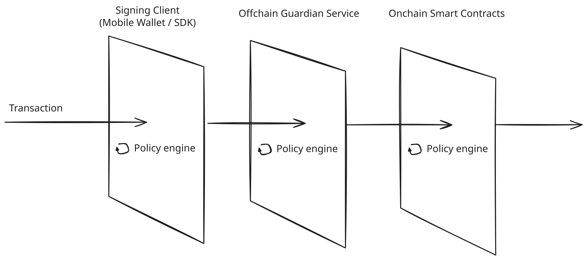
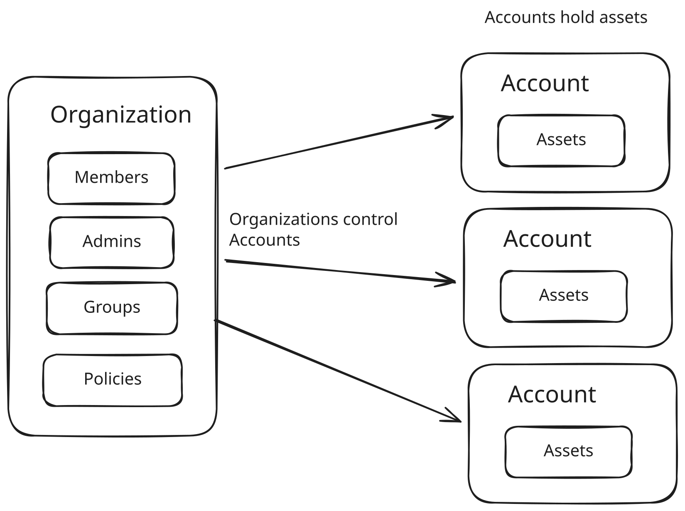
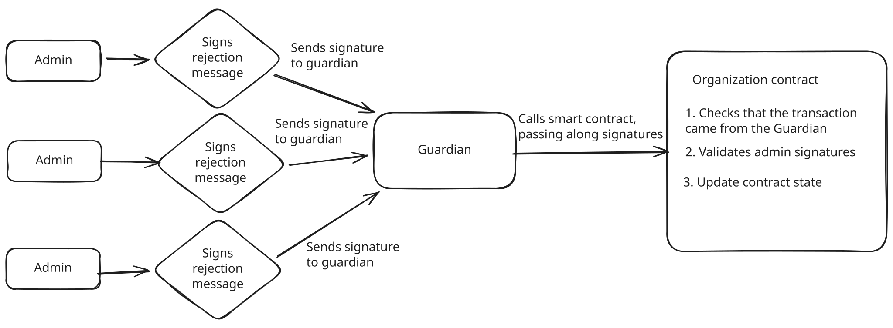
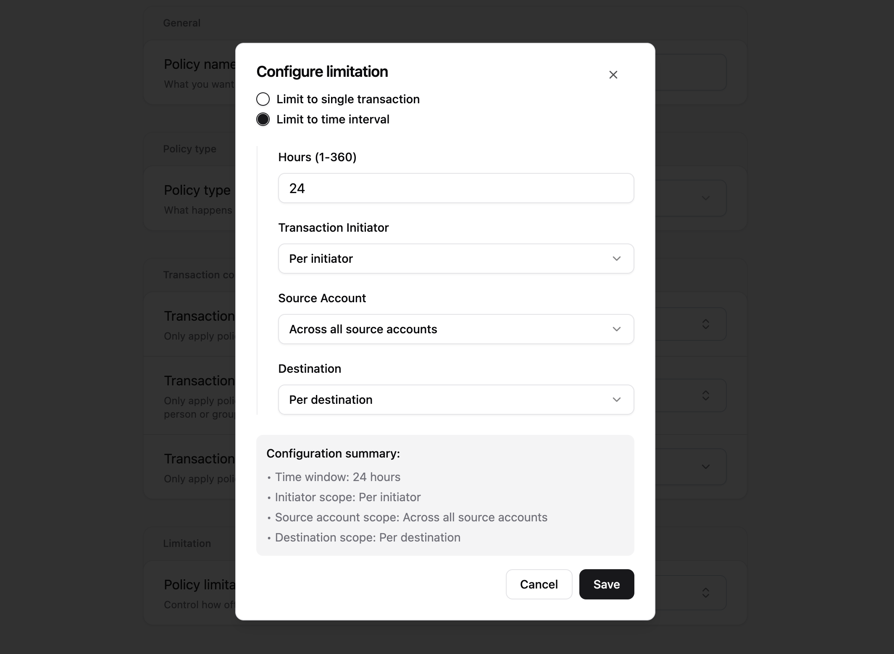
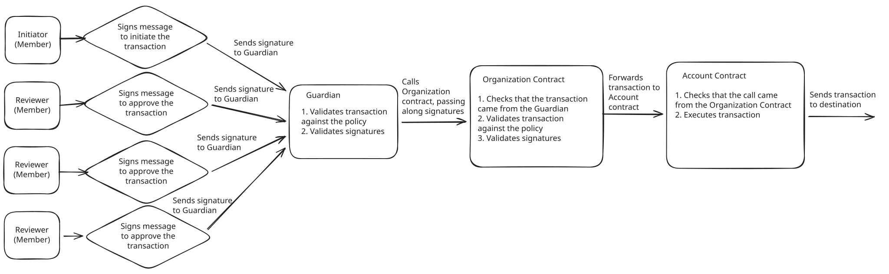
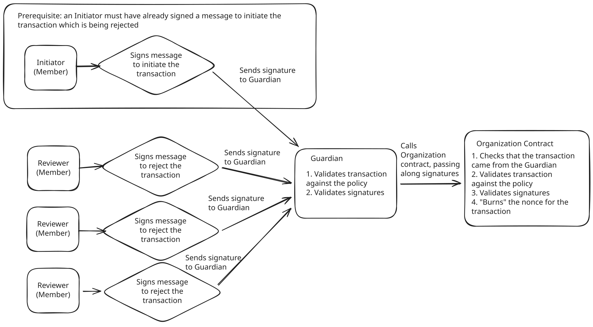
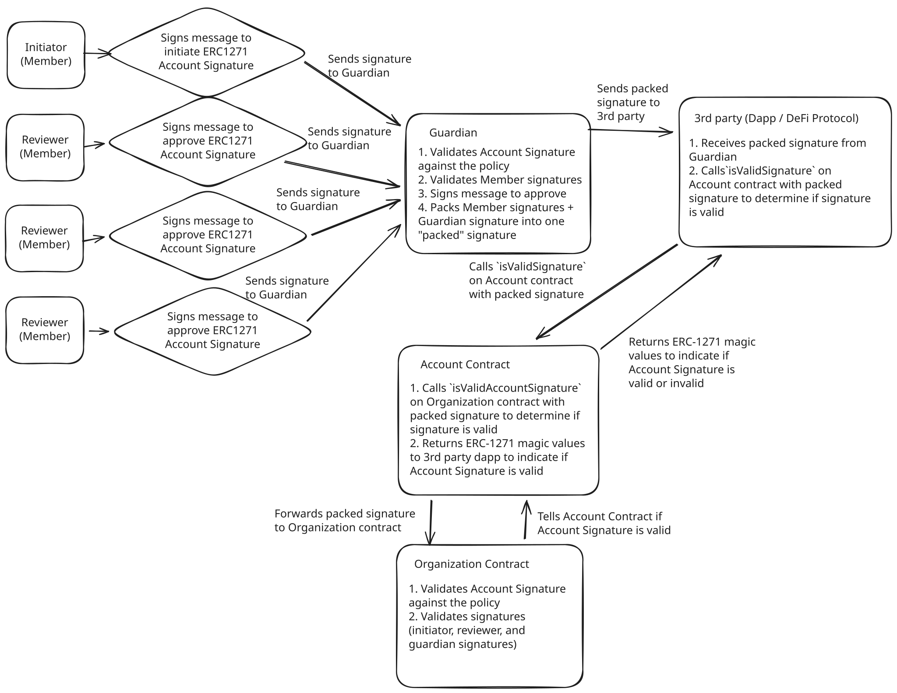

# Multi-layer Security (MLS) Wallet Smart Contracts

Smart contracts for Multi-layer Security (MLS) Wallet - a policy-based non-custodial custody solution for organizations.

> [!IMPORTANT]
> The contents of this document and this repository are confidential. Do not share without expressed written permission from the Den team.

---

## Table of Contents

1. [Overview](#overview)
2. [Core Concepts](#core-concepts)
   - [Three Layers of Security](#three-layers-of-security)
   - [Key Abstractions](#key-abstractions)
   - [Operations (Overview)](#operations-overview)
   - [Disaster Recovery (Overview)](#disaster-recovery-overview)
3. [Admin Operations](#admin-operations)
4. [Policies](#policies)
5. [Account Transactions](#account-transactions)
6. [Account Signatures (ERC-1271)](#account-signatures-erc-1271)
7. [Architecture](#architecture)
   - [Merkle-Based Storage](#merkle-based-storage)
   - [Core Contracts](#core-contracts)
   - [Factory Patterns](#factory-patterns)
   - [Upgradeability (Proxy Patterns)](#upgradeability-proxy-patterns)
8. [Guardian Protection](#guardian-protection)
9. [Signatures](#signatures)
10. [Disaster Recovery](#disaster-recovery)
11. [Deployment](#deployment)

### Supplementary Documentation

For detailed deep-dives on specific topics, see the following documents in the `docs/` directory:

| Document | Description |
|----------|-------------|
| [MERKLETREE_ARCHITECTURE.md](./docs/MERKLETREE_ARCHITECTURE.md) | Detailed explanation of Merkle tree storage, nested structures, and proof verification |
| [GUARDIAN_PROTECTION.md](./docs/GUARDIAN_PROTECTION.md) | Guardian architecture, SafeExecutorModule, BatchedTransaction, and update flows |
| [SIGNATURES.md](./docs/SIGNATURES.md) | Signature encoding formats, EIP-712, nonces, and signed message types |
| [DISASTER_RECOVERY.md](./docs/DISASTER_RECOVERY.md) | Guardian recovery and transaction recovery mechanisms |
| [DEPLOYMENT.md](./docs/DEPLOYMENT.md) | Step-by-step deployment instructions and configuration |

---

## Overview

MLS Wallet stores organization assets in smart contracts governed by **policies** - "if-then" rules that dictate what transactions can be executed and by whom. Unlike traditional multisig wallets, MLS Wallet provides:

- **Policy-based authorization**: Fine-grained control over transaction types, amounts, recipients, and approval requirements
- **Multiple redundant security layers**: Mobile wallet, offchain Guardian service, and onchain smart contracts independently validate every transaction
- **Merkle-based storage**: Policies, members, and groups stored as merkle trees (only roots on-chain) for gas efficiency

---

## Core Concepts

### Three Layers of Security

MLS Wallet uses three independent security layers. Each layer validates transactions independently. An attacker would need to compromise all three simultaneously to execute unauthorized transactions.



| Layer | Location | Purpose |
|-------|----------|---------|
| **Signing Client** | Mobile wallet / SDK | Policy validation before signing; prevents invalid transactions from being created |
| **Guardian Service** | Off-chain server | Independent policy validation; confirms all required approvals present |
| **Smart Contracts** | On-chain | Final enforcement; blocks malicious transactions at blockchain level |


### Key Abstractions
Organizations, along with their Members, Groups, Admins, and Policies are represented onchain by an Organization smart contract. Organizations store their assets in Accounts, which are separate smart contracts.



| Abstraction | Description |
|-------------|-------------|
| **Organization** | The on-chain representation of a business entity. Stores all state (members, groups, policies, admin config). Does NOT hold funds. |
| **Account** | Smart contract wallet that holds assets. Owned by an Organization. Executes transactions only when called by its Organization. |
| **Member** | A person or API identity belonging to an Organization. Identified by an address (EOA or smart contract). |
| **Group** | A collection of Members organized by function (e.g., "Finance Team"). Used for approval thresholds. |
| **Admin** | Privileged Member(s) or Group that can modify Organization configuration. Changes require threshold signatures. |
| **Policy** | "If-then" rule defining what transactions are allowed, by whom, and how often. Stored as merkle tree leaves. |


### Operations (Overview)

MLS Wallet supports three distinct operation types, each with its own workflow:

| Operation Type | Purpose | Entry Point | Rejection Support |
|----------------|---------|-------------|-------------------|
| **Admin Operations** | Modify Organization state (members, groups, policies, admins) | `Organization.*` functions | Yes |
| **Account Transactions** | Execute transactions from Accounts (transfers, DeFi, etc.) | `Organization.executeAccountTransaction()` | Yes |
| **Account Signatures** | ERC-1271 signature validation for smart contract interactions | `Account.isValidSignature()` | No (stateless) |

### Disaster Recovery (Overview)

MLS Wallet provides two independent recovery mechanisms to handle Guardian compromise or unavailability:

| Recovery Type | Purpose | Entry Point | Timelock Required |
|---------------|---------|-------------|-------------------|
| **Guardian Recovery** | Replace compromised or unavailable Guardian | `Organization.initiateRecoveryGuardianUpdate()` | Yes (3-step process) |
| **Transaction Recovery** | Execute transactions and ERC-1271 signatures without Guardian | `Organization.executeRecoveryAccountTransaction()` | Yes (to enable) |

Both mechanisms use separate privileged addresses (`guardianRecoveryAddress` and `transactionAndERC1271RecoveryAddress`) configured at Organization initialization. For detailed flows and scenarios, see [Disaster Recovery](#disaster-recovery).

---

## Admin Operations

Admin operations modify organizational state and require admin threshold signatures.

### Admin Operation Types

| Operation | Description | Files |
|-----------|-------------|-------|
| `ModifyAdmins` | Change admin configuration | `OrganizationAdminBase.sol`, `LibOrganizationAdmin.sol` |
| `ModifyMembers` | Update members merkle root | `OrganizationMembersBase.sol`, `LibOrganizationMembers.sol` |
| `ModifyGroups` | Update groups merkle root | `OrganizationGroupsBase.sol`, `LibOrganizationGroups.sol` |
| `ModifyPolicies` | Update policies merkle root | `OrganizationPolicyBase.sol`, `LibOrganizationPolicy.sol` |
| `UpdateGuardian` | Initiate/finalize Guardian change | `OrganizationGuardianBase.sol`, `LibOrganizationGuardian.sol` |
| `Upgrade` | Upgrade Organization implementation | `OrganizationImplementation.sol` |
| `DeployAccount` | Deploy a new Account | `OrganizationAccountFactoryBase.sol` |
| `UpgradeAccount` | Upgrade Account implementation (beacon) | `OrganizationAccountFactoryBase.sol` |

### Who can approve or reject Admin Operations?
Only Members who are "Admins" according to the Organization contract can approve or reject Admin Operations.

### Approving Admin Operations

Steps to approve an Admin Operation:
1. **Admins sign an approval message** – Needs more than a threshold amount of signatures
2. **Guardian collects the signatures**
3. **Guardian sends the signatures to the Organization contract**
4. **Organization contract performs validations and updates state** – Checks that `msg.sender` is the Guardian, validates admin signatures


### Rejecting Admin Operations

The rejection workflow is nearly identical to the approval workflow. The key differences are:
1. Admins sign a **rejection** message (with `isApproval=false`) instead of an approval message
2. Guardian calls `rejectAdminOperation()` instead of the operation-specific function

Steps to reject an Admin Operation:
1. **Admins sign a rejection message**  – Needs more than a threshold amount of signatures
2. **Guardian collects the signatures**
3. **Guardian sends the signatures to the Organization contract** – Calls `rejectAdminOperation()`
4. **Organization contract performs validations and consumes nonce** – Checks that `msg.sender` is the Guardian, validates admin signatures


See [Signatures](#signatures) for EIP-712 message format and encoding details.

---
## Policies
Policies are "if-then" rules that dictate:
- Which Account Transactions can be executed and who can initiate, approve, or reject them.
- Which Account Signatures (ERC-1271) can be approved and who can initiate and approve them.

Example policies:
- "if a transaction is sending more than $10,000, then require approval from 2 out of 3 members of the Finance team"
- "if a transaction is sending less than $10,000, then require approval from 1 out of 3 members of the Finance team"
- "if a transaction is sending less than $1,000 from the Accounts Payable Account, then automatically approve the transaction"
- "if an ERC-1271 Account Signature is to be approved by our Treasury Account, then it requires approval from 2 out of 3 members of the Finance team


All Account Transactions and Account Signatures must be created using a Policy. This means that by default, all Account Transactions and Account Signatures are automatically rejected, and Policies act as allow-lists for which types of Account Transactions and Account Signatures are allowed.

### Policy Types
There are two types of policies:
1. **Auto-approval policies**

    If an Account Transaction or Account Signature is governed by an Auto-approval policy, then it only requires one signature from a Member ("initiator") to initiate it. 
    
    Any valid initiator can also reject an Account Transaction, without requiring additional signatures from other Members (Account Signatures cannot be rejected).

2. **Manual approval policies**

    If an Account Transaction or Account Signature is governed by a Manual approval policy, then in order for it to be approved, it must be:
    - initiated by an authorized Member (the "initiator")
    - approved by a Member or Group (the "reviewers")

    
    The same reviewers who are allowed to approve an Account Transaction are also authorized to reject it (Account Signatures cannot be rejected).

> **Notes:**
> - The policy specifies which Members (or Groups) can be initiators and reviewers
> - If the initiator is a Group, any member of that Group can initiate
> - If reviewers are a Group, the policy must specify a threshold
> - Rejection requires a valid initiator signature to have been provided first
> - Account Signatures cannot be rejected (stateless `view` function)


### Policy Configuration Fields

Policies define which transactions they govern using the following fields:

#### Core Fields (All Policies)

| Field | Description | Allowed Values |
|-------|-------------|----------------|
| **Source Account** | Which Account(s) this policy applies to | `Any source account` · Custom list of accounts |
| **Transaction Initiator** | Who can initiate transactions under this policy | `Any Member` · Specific Member · Specific Group* |
| **Transaction Type** | What kind of operation this policy governs | `Any` · `Token transfers` · `Contract interactions` · `Account Signature` |

*\* If set to a Group, any member of that Group can initiate.*

---

#### Token Transfer Fields

*Available when Transaction Type = "Token transfers"*

| Field | Description | Allowed Values |
|-------|-------------|----------------|
| **Token** | Which token can be transferred | `Any token` · Specific token (e.g., USDC) |
| **Token Transfer Recipient** | Where tokens can be sent | `Any recipient` · `Any whitelisted address` · `Any non-whitelisted address` · Custom address list |
| **Token Amount Threshold** | Maximum amount per transaction | Numeric value (policy applies to amounts ≤ this value) |

---

#### Contract Interaction Fields

*Available when Transaction Type = "Contract interactions"*

| Field | Description | Allowed Values |
|-------|-------------|----------------|
| **Contracts** | Which contracts can be called | `Any contract` · `Any whitelisted contract` · `Any non-whitelisted contract` · Custom contract list |
| **Functions** | Which functions can be called | `Any function` · Custom function list |
| **Function Arguments** | Parameter constraints for allowed functions | See [Parameter Constraints](#parameter-constraints) below |

---

#### Parameter Constraints

*Available when Transaction Type = "Contract interactions" and a custom function list is specified*

Parameter constraints provide fine-grained control over what values can be passed to function arguments.

**Supported Parameter Types:**

| Type | Description |
|------|-------------|
| `Uint` | Unsigned integers (uint8 to uint256) |
| `Int` | Signed integers (int8 to int256) |
| `Address` | Ethereum addresses (20 bytes) |
| `Bool` | Boolean values |
| `FixedBytes` | Fixed-size bytes (bytes1 to bytes32) |
| `Bytes` | Dynamic bytes |
| `String` | Dynamic strings |
| `Array` | Dynamic arrays |
| `Struct` | Tuples/struct types |

**Constraint Types:**

| Constraint | Description | Validation Logic |
|------------|-------------|------------------|
| `Any` | Wildcard - no constraint | No validation performed |
| `Exact` | Must match exactly | Direct comparison; `Bytes`/`String` use keccak256 hash comparison |
| `Range` | Must be within bounds | `value >= min && value <= max` (inclusive) |
| `OneOf` | Must be in allowed set | Merkle proof verification against root of allowed values |

**Compatibility Matrix:**

| Parameter Type | `Any` | `Exact` | `Range` | `OneOf` |
|----------------|:-----:|:-------:|:-------:|:-------:|
| `Uint`         | ✓ | ✓ | ✓ | ✗ |
| `Int`          | ✓ | ✓ | ✓ | ✗ |
| `Address`      | ✓ | ✓ | ✗ | ✓ |
| `Bool`         | ✓ | ✓ | ✗ | ✗ |
| `FixedBytes`   | ✓ | ✓ | ✗ | ✗ |
| `Bytes`        | ✓ | ✓ | ✗ | ✗ |
| `String`       | ✓ | ✓ | ✗ | ✗ |
| `Array`        | ✓ | ✗ | ✗ | ✗ |
| `Struct`       | ✓ | ✗ | ✗ | ✗ |

> **Notes:**
> - Constraints are applied sequentially in the order parameters appear in the function signature
> - Parameters without defined constraints accept any value
> - `Array` and `Struct` only support `Any` due to complex ABI encoding

See `src/types/PolicyTypes.sol` and `src/organization/libraries/policy/LibPolicyParameterConstraints.sol` for implementation details.

### Policy Rate Limits

Policies can have rate limiting configured to control how frequently they can be used. This enables scenarios like daily spending limits.

**Limitation Types:**

| Type | Description |
|------|-------------|
| `None` | No limitation - the policy can be used for unlimited transactions |
| `TimeInterval` | Time-based rate limiting - usage resets after a configurable time window |

**Time Interval Configuration** *(only applicable when limitation type is `TimeInterval`)*

When using time-based rate limiting, the following parameters can be configured:

- **Time Interval (Hours)**: The duration of the time window in hours (e.g., 24 for daily limits, 168 for weekly limits, 720 for monthly limits). Usage tracking resets at the start of each new time window.

- **Interval Limit**: The maximum allowed usage within each time window. For token transfer policies, this is the cumulative token amount. For contract interaction policies, this is the number of times the contract can be called during the time interval.

**Scoping Options:**

Time-based limits can be scoped in different ways for each of these dimensions:

| Scope Dimension | `AcrossAll` | `PerEntity` |
|-----------------|-------------|-------------|
| **Initiator** | Single shared limit across all initiators | Separate limit tracked per initiator |
| **Source Account** | Single shared limit across all source accounts | Separate limit tracked per source account |
| **Destination** | Single shared limit across all destinations | Separate limit tracked per destination |

**Example configurations:**

- *"$10,000/day per initiator"*: Set `initiatorScope = PerEntity`, `sourceScope = AcrossAll`, `destinationScope = AcrossAll`. Each initiator has their own $10,000 daily limit.

- *"$50,000/month total from Treasury account"*: Set `initiatorScope = AcrossAll`, `sourceScope = PerEntity`, `destinationScope = AcrossAll`. The Treasury account has a shared $50,000 monthly limit regardless of who initiates or where funds go.

- *"5 transactions/day to each whitelisted address"*: Set `initiatorScope = AcrossAll`, `sourceScope = AcrossAll`, `destinationScope = PerEntity`. Each destination address has its own limit of 5 transactions per day.

**Usage Tracking:**

- For **Token Transfer** policies: Usage is tracked as the cumulative token amount transferred within the time window.
- For **Contract Interaction** policies: Usage is tracked as the count of transactions (each transaction counts as 1).

See `src/types/PolicyTypes.sol` (specifically `PolicyLimitation`, `TimeIntervalScope`, and `TimeLimitConfig`) and `src/organization/libraries/policy/LibPolicyTimeBasedLimits.sol` for implementation details.


*The user interface for editing a Policy's limitation in the Multi-layer Security (MLS) Wallet web application*

### Demo of Policies
We highly recommend viewing the demo web application for Multi-layer Security (MLS) Wallet to understand how policies are defined from the web application.

To view a demo of Multi-layer Security (MLS) Wallet's user interface for modifying Policies, visit:
https://mls-wallet-demo.onchainden.com/policies

To view the demo, please request a username and password from the Den team.

---

## Account Transactions

### What is an Account Transaction?
Account Transactions are versitile onchain transactions sent from Accounts. Account Transctions can be token transfers, DeFi operations, or any other smart contract interaction. 

For security, Account Transactions only support `call` operations, and `delegatecall` operations are strictly forbidden.

### Using Policies to Create Account Transactions
Account Transactions must be created using a Policy. The Policy defines what types of transactions are allowed. If an Account Transaction is created using a Policy that does not allow the transaction, it is rejected.

The Policy that's used to create an Account Transaction determines which Members of the Organization (if any) must approve the transaction before it can be executed.

### Who can approve or reject an Account Transaction?
The Policy that's used to create the transaction dictates who can approve or reject the transaction:
* If the Policy is an **AutoApproval Policy**:
  - Only Members that are specified by the Policy as **initiators** can **initiate and execute the transaction.**
  - Only Members that are specified by the Policy as **initiators** can **reject the transaction.**
  - _Note: AutoApproval policies don't require separate approval signatures from reviewers to be executed. They just need one valid Initiator signature._
* If the Policy is a **ManualApproval Policy**:
  - Only Members that are specified by the Policy as **initiators** can **initiate the transaction.**
  - Only Members that are specified by the Policy as **reviewers** can **approve and execute the transaction.**
  - Only Members that are specified by the Policy as **reviewers** can **reject the transaction and burn the nonce.**
  - _Note: The transaction must have been initiated with a valid initiator signature in order for reviewers to approve or reject it._

**Key Point:** Rejection requires the same authorization level as approval. This prevents unauthorized actors from blocking legitimate transactions.

### Approving (Executing) Account Transactions

1. **Initiator signs a message approving the transaction** — A Member (the "Initiator") signs transaction data (EIP-712 typed data with `isApproval=true`).
   - Parameters: `account`, `to`, `value`, `data`, `salt`, `expirationTimestamp`, `policyId`
2. **Reviewers sign a message approving the transaction** (if ManualApproval policy) — This step is skipped if the policy is an AutoApproval policy.
3. **Guardian collects the signatures**
4. **Guardian validates the transaction against the policy** — Guardian service validates that the transaction is allowed by the policy provided and validates initiator and reviewer signatures.
    - If the policy is an AutoApproval policy, reviewer signatures are not checked –  only the initiator signature is checked
    - _Note: This happens offchain before submitting the transactions and signatures to the Organization smart contract._
5. **Guardian sends the transaction and signatures to the Organization contract** — Guardian calls `Organization.executeAccountTransaction()` with all signatures and proofs
6. **Organization contract performs all validations** – Checks that `msg.sender` is the Guardian, validates that the transaction is allowed by the policy provided, and validates initiator and reviewer signatures
    - If the policy is an AutoApproval policy, reviewer signatures are not checked s- only the initiator signature is checked
7. **Organization contract forwards transaction to the Account contract** — Organization calls `Account.executeTransaction(to, value, data, nonce, policyId)`
8. **Account contract executes the transaction** – Account contract checks that `msg.sender` is its associated Organization contract and then executes the transaction



### Rejecting Account Transactions
> [!IMPORTANT]
> An Initiator must have already signed a message to initiate the transaction that is being rejected

1. **(Prerequisite) Initiator has already signed a message to initiate the transaction** — The original initiator signature for the transaction that's being rejected must be passed along
2. **Authorized Members sign a message rejecting the transaction** – See [Who can approve or reject an Account Transaction?](#who-can-approve-or-reject-an-account-transaction)
3. **Guardian collects the signatures**
4. **Guardian validates the transaction against the policy** — Guardian service validates that the transaction would have been allowed by the policy provided and validates initiator and rejection signatures.
    - If the policy is an AutoApproval policy, rejection signatures must come from Members who are allowed to initiate the transaction according to the policy.
    - If the policy is a ManualApproval policy, rejection signatures must come from Members who are specified as "reviewers" by the policy.
    - _Note: This happens offchain before submitting the transactions and signatures to the Organization smart contract._
5. **Organization contract performs all validations** – Checks that `msg.sender` is the Guardian, validates that the transaction would have been allowed by the policy provided, and validates initiator and rejection signatures
    - If the policy is an AutoApproval policy, rejection signatures must come from Members who are allowed to initiate the transaction according to the policy.
    - If the policy is a ManualApproval policy, rejection signatures must come from Members who are specified as "reviewers" by the policy.
6. **Organization contract burns the nonce for the transaction** — Organization burns the nonce for the transaction, making it impossible to use existing initiator and approval signatures to execute the transaction



### Policy Validation Details

When an Account Transaction is validated against a Policy, the policy engine validates:

1. **Policy exists** - Merkle proof against `policiesRoot`
2. **Source account allowed** - Either `anySourceAccount=true` or account in policy's source accounts tree
3. **Initiator authorized** - Member/group membership verified via merkle proofs
4. **Transaction type matches** - TokenTransfers, ContractInteractions, or Any
5. **Destination allowed** - Either any destination or merkle-verified custom list
6. **Token/amount constraints** - For token transfers
7. **Function/parameter constraints** - For contract interactions

For signature formats and message types, see [Signatures](#signatures).

Files: `OrganizationAccountTransactionBase.sol`, `LibOrganizationAccountTransaction.sol`

---

## Account Signatures (ERC-1271)

### What is an Account Signature?

Account Signatures are ERC-1271 signature validations that allow Accounts to "sign" messages. Account Signatures enable Accounts to interact with protocols that require signature verification, such as:
- **Permit2** — Gasless token approvals
- **CoW Protocol** — Off-chain order signing
- **Off-chain order books** — DEX limit orders

In many ways, Account Signatures are similar to Account Transactions:
- They must be created using a Policy
- They must be initiated by a member authorized by the Policy
- They need additional approval signatures to be valid if the Policy is a ManualApproval policy.

However, there are some keys differences:
- The entry point for Account Signatures is the Account contract itself (`Account.isValidSignature()`), not the Organization contract. 
    - Third parties call the Account directly to verify signatures. 
    - This is required to be compliant with the ERC-1271 standard.
- Account Signatures can't be rejected.

### Using Policies to Create Account Signatures

Like Account Transactions, Account Signatures must be authorized using a Policy. The Policy defines:
- Which Members can initiate the signature
- Whether additional reviewer approvals are required and how many
- Which Accounts the policy applies to

**Important:** The Policy must be configured to be a `TransactionType.Signatures` policy. Policies configured for `TokenTransfers` or `ContractInteractions` cannot be used for Account Signatures.

### Who can approve an Account Signature?

The Policy used to create the signature dictates who can approve it:

* If the Policy is an **AutoApproval Policy**:
  - Only Members that are specified by the Policy as **initiators** can create and approve the signature.
  - _Note: AutoApproval policies don't require separate approval signatures from reviewers._

* If the Policy is a **ManualApproval Policy**:
  - Only Members that are specified by the Policy as **initiators** can initiate the signature.
  - Only Members that are specified by the Policy as **reviewers** can approve the signature.
  - The threshold number of reviewer approvals must be met.

> [!NOTE]
> Unlike Account Transactions, Account Signatures **cannot be rejected**. This is because `isValidSignature()` is a `view` function that cannot modify state (no nonce to burn).

### Approving Account Signatures

1. **Initiator signs a message** — A Member (the "Initiator") signs the message hash being validated (EIP-712 typed data).
   - Parameters: `account`, `hash`, `policyId`, `expirationTimestamp`
2. **Reviewers sign a message** (if ManualApproval policy) — This step is skipped if the policy is an AutoApproval policy.
3. **Guardian collects the signatures**
4. **Guardian validates the signature against the policy** — Guardian service validates that the signature is allowed by the policy provided and validates initiator and reviewer signatures.
    - If the policy is an AutoApproval policy, reviewer signatures are not checked –  only the initiator signature is checked
    - _Note: This happens offchain before the Guardian signs the review hash._
5. **Guardian signs a message** — Guardian service signs the review hash.
   - _Note: Unlike Account Transactions where Guardian calls the function, here the Guardian provides a signature._
6. **Guardian sends all signatures to third party** — All signatures and proofs are ABI-encoded and packed together, and then sent to the third party that wants to validate the ERC-1271 signature
7. **Third party calls `isValidSignature()` on Account contract using signatures from Guardian** — The packed signature sent from the Guardian to the third party is passed to the Account.
8. **Account delegates to Organization contract** — Account calls `Organization.isValidSignatureForAccount()` passing along all the signatures
9. **Organization contract validates all signatures and policy** — Checks expiration, initiator, guardian, policy authorization, and reviewer approvals.
    - If the policy is an AutoApproval policy, reviewer signatures are not checked
10. **Account Contract returns ERC-1271 Magic values** — Returns `0x1626ba7e` for valid, `0xffffffff` for invalid.



### Policy Validation Details

When validating a signature, the same policy checks are performed as Account Transactions:

1. **Policy exists** — Merkle proof against `policiesRoot`
2. **Transaction type matches** — Must be `TransactionType.Signatures`
3. **Source account allowed** — Either `anySourceAccount=true` or account in policy's source accounts tree
4. **Initiator authorized** — Member/group membership verified via merkle proofs

For signature formats and message types, see [Signatures](#signatures).

For recovery signatures (type `0x00`), see [Disaster Recovery](#disaster-recovery).

Files: `AccountImplementation.sol:54-62`, `OrganizationAccountSignatureBase.sol`, `LibOrganizationAccountSignature.sol`

---

## Architecture

### Merkle-Based Storage

A key architectural decision in MLS Wallet is the use of **Merkle trees** to store Members, Groups, Admins, and Policies. Instead of storing data directly on-chain (which would be prohibitively expensive for large organizations), only 32-byte Merkle roots are stored. The full data lives off-chain (on IPFS), and callers provide Merkle proofs to verify membership.

**Why this matters:**
- **Gas efficiency** — Modifying 1,000 members costs the same as modifying 10 (~20K gas for one `SSTORE`)
- **Scalability** — Organizations can have thousands of members and complex policies without gas costs scaling linearly
- **Complex policies** — Policies can reference large lists of source accounts, destinations, and functions with parameter constraints

**What's stored as Merkle trees:**

| Data | Root Storage | Structure |
|------|--------------|-----------|
| Members | `membersRoot` | Flat tree of member addresses |
| Groups | `groupsRoot` | Nested: each group has its own members sub-tree |
| Admins | `adminsRoot` | Flat tree of admin addresses (must also be in Members) |
| Policies | `policiesRoot` | Multi-level nested (up to 4 levels deep) |

For detailed documentation on the Merkle tree architecture, including nested structures, leaf computation, and how proofs are passed to function calls, see **[MERKLETREE_ARCHITECTURE.md](./docs/MERKLETREE_ARCHITECTURE.md)**.

---

### Core Contracts

#### Organization (`src/organization/`)

The Organization contract is the central hub that:
- Stores all organizational state (members, groups, policies, admin configuration)
- Validates and executes transactions on behalf of Accounts
- Acts as a Beacon for Account proxies
- Enforces Guardian protection on all external functions

**Key files:**
| File | Purpose |
|------|---------|
| `OrganizationProxy.sol` | ERC-1967 UUPS proxy |
| `OrganizationImplementation.sol` | Main implementation, inherits all base contracts |
| `OrganizationFactory.sol` | CREATE2 deployment for deterministic addresses |
| `base/*.sol` | Modular base contracts (Admin, Members, Groups, Policy, etc.) |
| `libraries/*.sol` | Business logic libraries |
| `libraries/storage/*.sol` | EIP-7201 namespaced storage libraries |

#### Account (`src/account/`)

The Account contract is a thin wrapper that:
- Holds organization assets (ETH, tokens)
- Executes transactions only when called by its Organization
- Delegates ERC-1271 signature validation to the Organization

**Key files:**
| File | Purpose |
|------|---------|
| `AccountProxy.sol` | BeaconProxy (Organization is the beacon) |
| `AccountImplementation.sol` | Simple execution logic |

#### Implementation Whitelist (`src/implementation-whitelist/`)

A separate contract that maintains a whitelist of approved implementation addresses. Used to validate upgrades:
- Prevents malicious implementation swaps
- Controlled independently from individual Organizations

#### Organization Factory (`src/organization/OrganizationFactory.sol`)

A factory contract that deploys Organization contracts at deterministic addresses using CREATE2:
- Enables same Organization address across all EVM-compatible chains
- Validates implementation against the whitelist before deployment
- Atomically deploys and initializes Organizations in a single transaction

**Key files:**
| File | Purpose |
|------|---------|
| `OrganizationFactory.sol` | CREATE2 deployment for deterministic addresses |

---
### Factory Patterns

MLS Wallet uses a two-tier factory system to deploy Organizations and Accounts at deterministic addresses across chains.

#### OrganizationFactory

Organizations are deployed via the `OrganizationFactory` contract using CREATE2:

| File | Purpose |
|------|---------|
| `OrganizationFactory.sol` | Factory contract for deploying OrganizationProxy contracts |

**Key Characteristics:**
- **Authorized deployer only** — Only the `DEPLOYER_ADDRESS` (set in the constructor) can deploy new Organizations (in production this is the Guardian)
- **Implementation whitelist validation** — The implementation address must be whitelisted before deployment
- **Atomic deployment + initialization** — The proxy is deployed and initialized in a single transaction to prevent front-running
- **Address pre-computation** — Use `computeOrganizationAddress(salt, implementation, whitelist)` to compute the address before deployment

See: `OrganizationFactory.sol`

---

#### Organization as Account Factory

Each Organization acts as a factory for its own Accounts. Accounts are deployed as BeaconProxies where the Organization itself serves as the beacon.

| File | Purpose |
|------|---------|
| `OrganizationAccountFactoryBase.sol` | Base contract with account deployment logic |
| `LibOrganizationAccountFactory.sol` | Library for CREATE2 account deployment |


**Key Characteristics:**
- **Guardian-protected** — Only the Guardian can call `deployAccount()`
- **Admin authorization required** — Requires Admin signatures meeting the configured threshold
- **Organization tracks deployed accounts** — Each Organization maintains a mapping of accounts it deployed
- **Beacon pattern** — The Organization implements `IBeacon.implementation()` and all Accounts under an Organization share the same implementation
- **Address pre-computation** — Use `computeAccountAddress(salt)` on the Organization to compute the address before deployment

See: `OrganizationAccountFactoryBase.sol`, `LibOrganizationAccountFactory.sol`

---

#### CREATE2 and Deterministic Addresses

Both Organizations and Accounts use CREATE2 for deployment, ensuring **identical addresses across all EVM-compatible chains**.

**How it works:**

```
address = keccak256(0xff ++ deployerAddress ++ salt ++ keccak256(bytecode))[12:]
```

| Factor | Organizations | Accounts |
|--------|---------------|----------|
| **Deployer** | OrganizationFactory | Organization contract |
| **Salt** | User-provided `bytes32` | User-provided `bytes32` |
| **Bytecode** | OrganizationProxy + constructor args | AccountProxy + constructor args |

**Cross-chain deployment requirements:**

To achieve the same Organization address on multiple chains:
1. Deploy `OrganizationFactory` at the same address on each chain
2. Use the same `salt`
3. Use the same `implementationAddress` and `whitelistAddress`

To achieve the same Account address on multiple chains:
1. Deploy the Organization at the same address on each chain (see above)
2. Use the same `salt` when calling `deployAccount()`

---

#### Implementation Whitelist Validation

**Both Organizations and Accounts can only be deployed (or upgraded) using implementation contracts that are whitelisted.**

| Contract Type | Validated During |
|---------------|------------------|
| Organization | `OrganizationFactory.deployOrganization()` and `Organization.upgradeToAndCallWithAuthorization()` |
| Account | `Organization.setAccountImplementation()` |


This design ensures that:
- **Den controls which implementations are allowed** — The whitelist is owned by a Safe multisig that Den controls
- **Protection against malicious upgrades** — Even if an Organization's Guardian and Admins are compromised, they cannot deploy or upgrade to a malicious implementation
- **Separate whitelists per contract type** — Organization and Account implementations are tracked independently

See: `ImplementationWhitelistImplementation.sol`, `IImplementationWhitelist.sol`

---

### Upgradeability (Proxy Patterns)

Most contracts in MLS Wallet are upgradeable. This section explains the proxy patterns used, how upgrades work, and how they are secured.

#### Organization Upgrades

Each Organization is an **ERC-1967 UUPS Proxy**.

| File | Purpose |
|------|---------|
| `OrganizationProxy.sol` | Proxy contract |
| `OrganizationImplementation.sol` | Implementation contract |

**Upgrade Requirements:**
1. **Guardian must execute** — Only the Guardian can call `upgradeToAndCallWithAuthorization()`
2. **Admin signatures** — Requires Admin signatures meeting the configured threshold
3. **Whitelisted implementation** — The new implementation must be whitelisted in the `ImplementationWhitelist` contract

See: `OrganizationImplementation.sol:67-103`

---

#### Account Upgrades

Accounts use a **Beacon Proxy** pattern where the associated Organization acts as the Beacon.

| File | Purpose |
|------|---------|
| `AccountProxy.sol` | Beacon Proxy contract |
| `AccountImplementation.sol` | Implementation contract |

**Key Characteristics:**
- The Organization implements `IBeacon.implementation()` and returns the current `AccountImplementation` address
- **All Accounts under an Organization are upgraded at once** — there is no way to upgrade individual Accounts
- Individual Accounts do not control their own upgrades; upgrades are managed entirely through the Organization

**Upgrade Requirements:**
1. **Guardian must execute** — Only the Guardian can call `setAccountImplementation()` *on the Organization contract*
2. **Admin signatures** — Requires Admin signatures meeting the configured threshold
3. **Whitelisted implementation** — The new implementation must be whitelisted in the `ImplementationWhitelist` contract

See: `OrganizationAccountFactoryBase.sol:49-75`

---

#### Implementation Whitelist

All upgrades for Organizations and Accounts can only target implementation contracts that have been whitelisted by the **ImplementationWhitelist** contract.

| File | Purpose |
|------|---------|
| `ImplementationWhitelistProxy.sol` | Proxy contract |
| `ImplementationWhitelistImplementation.sol` | Implementation contract |

**Key Characteristics:**
- The `ImplementationWhitelist` contract is itself an **ERC-1967 UUPS Proxy**
- Owned by a Safe multisig that Den controls
- The Safe can add/remove implementations from the whitelist and upgrade the whitelist contract itself
- Maintains separate whitelists for Organization implementations and Account implementations

This design ensures that even if an Organization's Guardian and Admins are compromised, they cannot upgrade to a malicious implementation that Den has not approved.

See: `ImplementationWhitelistImplementation.sol`, `LibImplementationWhitelistStorage.sol`

---

#### Storage Pattern (EIP-7201)

All upgradeable contracts (Organizations, Accounts, and the ImplementationWhitelist) use **EIP-7201 namespaced storage slots** to prevent storage collisions during upgrades.

We use a **storage library pattern** throughout our contracts. Each storage domain has a dedicated library (`Lib*Storage.sol`) that:
1. Defines a `Layout` struct containing the storage variables
2. Computes a unique storage slot using the EIP-7201 formula
3. Provides a `layout()` function that returns a reference to the storage at that slot

**Storage Libraries:**

| Library | Purpose |
|---------|---------|
| `LibOrganizationAdminStorage.sol` | Admin configuration |
| `LibOrganizationMembersStorage.sol` | Members merkle root |
| `LibOrganizationGroupsStorage.sol` | Groups merkle root |
| `LibOrganizationPolicyStorage.sol` | Policies merkle root and time-based limits |
| `LibOrganizationGuardianStorage.sol` | Guardian address and pending updates |
| `LibOrganizationSignaturesStorage.sol` | Used nonces |
| `LibOrganizationAccountFactoryStorage.sol` | Deployed accounts and account implementation address |
| `LibOrganizationUpgradeStorage.sol` | Whitelist address and upgrade authorization flag |
| `LibOrganizationRecoveryStorage.sol` | Recovery configuration and state |
| `LibOrganizationDeployerAddressStorage.sol` | Factory address for initialization authorization |
| `LibAccountOrganizationAddressStorage.sol` | Reads Organization address from beacon slot |
| `LibImplementationWhitelistStorage.sol` | Whitelisted implementations |

**Example:**

```solidity
// LibOrganizationMembersStorage.sol
library LibOrganizationMembersStorage {
    struct Layout {
        bytes32 membersRoot;
    }

    // EIP-7201 namespaced storage slot
    // Formula: keccak256(abi.encode(uint256(keccak256("den.mls-wallet.organization.members")) - 1)) & ~bytes32(uint256(0xff))
    bytes32 internal constant STORAGE_LOCATION = 0xb80799cfa22e7d42bb36b2b397b5d0bd56930d54ee4f345397b8ece603c6f300;

    function layout() internal pure returns (Layout storage _layout) {
        assembly {
            _layout.slot := STORAGE_LOCATION
        }
    }
}
```

This pattern ensures that:
- Storage slots are deterministic and collision-resistant
- New state variables can be added in future upgrades without overwriting existing data
- Each contract domain has isolated, well-documented storage

See: `src/organization/libraries/storage/`, `src/account/libraries/storage/`, `src/implementation-whitelist/libraries/storage/`

---

## Guardian Protection

The Guardian is an offchain service operated by Den that validates transactions independently before submitting them on-chain. It serves as a critical redundant security layer—even if vulnerabilities exist in the client or smart contracts, the Guardian provides an independent check.

**Key concepts:**
- Most Organization functions are protected by the `onlyGuardian` modifier
- The Guardian address is stored on each Organization and is the only address allowed to call most external functions
- The Guardian is implemented as a Safe multisig with a custom `SafeExecutorModule` for automated operations
- Guardian updates require a timelocked 3-step process (initiate → finalize → accept)

For detailed documentation on Guardian architecture, protected functions, the SafeExecutorModule, BatchedTransaction contract, and update flows, see **[GUARDIAN_PROTECTION.md](./docs/GUARDIAN_PROTECTION.md)**.

---

## Signatures

All operations in MLS Wallet require cryptographic signatures for authorization. The system uses a hybrid signature format supporting both EOA (ECDSA) and ERC-1271 smart contract signers.

**Key concepts:**
- **Hybrid format**: EOA signatures (65 bytes) and ERC-1271 signatures (23+N bytes with `v=0` prefix)
- **EIP-712 typed data**: All signatures use structured typed data with domain separator
- **Non-sequential nonces**: Salt-based nonces enable parallel operations (unlike Safe's sequential nonces)
- **Replay protection**: Chain ID in signed data prevents cross-chain replay attacks
- **Expiration**: Optional timestamp-based signature expiration

For detailed documentation on signature encoding formats, EIP-712 domain, nonce system, ERC-1271 account signature format, and signed message type references, see **[SIGNATURES.md](./docs/SIGNATURES.md)**.

---

## Disaster Recovery

MLS Wallet implements two independent recovery mechanisms to handle scenarios where the Guardian is compromised or unavailable.

| Mechanism | Purpose | Recovery Address |
|-----------|---------|------------------|
| **Guardian Recovery** | Replace compromised/unavailable Guardian | `guardianRecoveryAddress` |
| **Transaction Recovery** | Execute transactions without Guardian | `transactionAndERC1271RecoveryAddress` |

Both mechanisms use timelocked processes and separate privileged addresses configured at Organization initialization. Transaction Recovery is optional and must be explicitly enabled.

For detailed documentation on recovery flows, timelocks, ERC-1271 recovery signatures, and recovery scenarios, see **[DISASTER_RECOVERY.md](./docs/DISASTER_RECOVERY.md)**.

---

## Deployment

For detailed deployment instructions, see **[DEPLOYMENT.md](./docs/DEPLOYMENT.md)**.

[DEPLOYMENT.md](./docs/DEPLOYMENT.md) includes:
- Signer setup (Foundry keystore or Ledger)
- Step-by-step deployment commands
- Guardian/Admin Safe configuration
- Library linking requirements
- Troubleshooting guide
