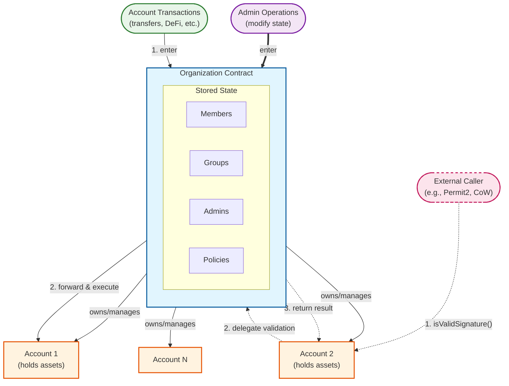

# Core Concepts Diagram

## Legend

| Flow | Description | Path |
|------|-------------|------|
| **Admin Operations** (solid thick arrow) | Modify Organization state (members, groups, policies, admins) | Organization → Organization |
| **Account Transactions** (solid arrow) | Execute transactions from Accounts | Organization → Account |
| **Account Signatures** (dashed arrow) | ERC-1271 signature validation | Account → Organization → Account |
